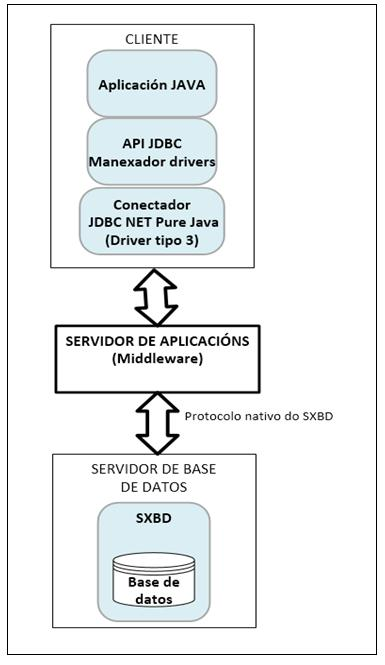
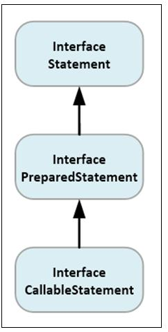
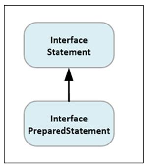

Unidad 3: Acceso a base de datos relacionais

C.S. de Desarrollo de Aplicaciones Multiplataforma

# Índice
1. Acceso a bases de datos relacionais utilizando JDBC.
2. Protocolos de acceso a base de datos relacionais.
3. API's de acceso a base de datos.
4. APIS standards para acceso a base de datos.
5. Base de Datos Independentes e Embebidas.
6. Aceso a base de datos relacionais dende Java: Conectividade JDBC.
7. Modelos de acceso da API JDBC ás base de datos.
8. Tipos de Conectadores JDBC.
9. Paquetes da API JDBC.
10. Clases e interfaces do paquete java.sql.
11. Pasos para acceder a unha base de datos utilizando API JDBC.
12. O interface Connection.
13. Crear e executar instrucións SQL.
14. Execución de sentenzas de consulta e modificación de datos e procedementos almacenados.
15. Execución de sentenzas SQL simples: A interface Statement.
16. Execución de sentenzas precompiladas: A interface PreparedStatement.
17. Executar procedementos almacenados e funcións: Interface CallableStatement.
18. Acceso aos Metadatos.
19. Interface DatabaseMetaData.
20. Interface ResultSetMetaData.
21. Xestión de Transaccións e procesamento por lotes.
22. Xestión de transaccións.
23. Procesamento por lotes e transaccións.

Unidad 3: Acceso a base de datos relacionais

## 1. Acceso a bases de datos relacionais utilizando JDBC.

### 1.1 Protocolos de acceso a base de datos relacionais.

La maioría dos SXBD relacionais teñen unha interface interactiva para introducir e executar directamente as ordes SQL. Exemplo: en ORACLE, a utilidade para este fin chámase SQL-Plus. En SQL Server 2008, ten unha ferramenta gráfica chamada SQL Management Studio.

### 1.2 API's de acceso a base de datos.

Existen varias aproximacións para interactuar cunha base de datos dende un programa de aplicación:

* Embeber as ordes SQL dunha base de datos relacional nunha linguaxe de programación anfitrión (LPA) de propósito xeral (C, Pascal, etc.).

### 1.3 APIS standards para acceso a base de datos.

Necesítase un precompilador que prové o vendedor do SGBD (en Oracle, por exemplo: Prol*C) que traduce as sentenzas SQL converténdoas en chamadas a unhas librerías específicas, polo tanto, é dependente dun SXBD relacional en particular.


Exemplo do proceso de compilación dun programa con sentenzas SQL embebidas na linguaxe C

 y transformado el índice en una lista. He mantenido las imágenes y no he alterado el contenido del PDF.


Unidad 3: Acceso a base de datos relacionais

- Usar unha biblioteca de funcións de base de datos. En lugar de modificar os compiladores ou empregar precompiladores, pódense utilizar librerías de funcións de acceso á base de datos. Esta aproximación proporciona, o que se coñece como API (Application Programming Interface) para acceder a base de datos. As aplicacións só se comunican coa API e esta é a encargada de comunicarse coa base de datos.


Exemplo de Acceso a base de datos utilizando unha biblioteca de funcións

### API's de acceso a base de datos

Unha API de acceso a base de datos é unha biblioteca de funcións e interfaces para realizar a maioría de accións de manexo de base de datos que os programadores poden requirir: conectar cunha base de datos, executar sentenzas SQL, recuperar unha fila individual do resultado dunha consulta, etc.

Para poder acceder e manipular a información dunha base de datos é necesario levar a cabo a instalación de certas APIs, que son indispensables para efectuar a conectividade dos datos externos, e vinculalas á aplicación para a súa correcta e adecuada utilización.

Existen varias API de acceso a base de datos:

- APIs nativas: a maioría dos fabricantes de SXBD ofrecen APIS nativas propias para acceder as súas bases de datos e que son únicas.


Estrutura xeral de acceso a distintas bases de datos utilizando APIS Nativas de cada fabricante

Unha vantaxe é que os fabricantes das APIs nativas optimizan estas interfaces para o acceso o seu SXBD propio, dando soporte a todas as funcións de acceso á base de datos e mellórase o rendemento, posto que a conexión entre a nosa aplicación e o motor de base de datos é directa e non necesita de intermediarios.

O inconveniente é que estas API nativas son diferentes para cada SXBD (tanto nos nomes das funcións que se utilizan para crear unha conexión á base de datos, para lanzar unha consulta, como no tratamento de erros, resultados, etc...) o que obriga aos programadores a adaptar cada programa ás características de cada xestor de base de datos.

Un exemplo de API nativa é Oracle Call Interface (OCI). Esta interface nativa permite conectar e procesar sentenzas SQL nunha base de datos Oracle sen necesidade de ningún controlador externo. Para utilizar a API OCI, so se necesita instalar e configurar Oracle SQL*Net nas computadoras clientes para acceder ao servidor Oracle.

- APIs Standard de acceso a base de datos: Están compostas por un conxunto de bibliotecas de funcións que unifican e estandarizan o acceso ás bases de datos. Grazas a isto, unha aplicación pode acceder a calquera base de datos sen necesidade de modificar a aplicación.

Con todo, para que isto sexa posible é necesario que o fabricante ofreza un conectador (conectador ou controlador) que cumpra a especificación da APIs Estándar. A aplicación dirixe todas as peticións ao conectador, que ten por misión traducir as chamadas aos métodos, a ordes nativas do xestor da base de datos.

### Conectador ou driver

Conxunto de clases encargadas de implementar as interfaces do API e acceder ás bases de datos. Cada conectador é específico para un SXBD en particular, por exemplo, un conectador para Oracle non pode acceder directamente aos datos do SXBD MySQL.

Os conectadores expoñen as capacidades do SXBD subxacente, pero non están obrigados a implementar as funcións que non admita o SXBD. Por exemplo, si o SXBD subxacente non admite combinacións externas, tampouco o conectador.

As tarefas específicas realizadas polos conectadores son:

- Conexión e desconexión da base de datos.
- O envío das instrucións SQL para a súa execución ao SXBD. Ás veces implica converter as instrucións SQL a instrucións SQL do SXBD específico.
- A recuperación dos datos proporcionados polo SXBD, incluíndo a conversión de tipos de datos segundo o especificado pola aplicación.


Estrutura xeral de acceso a distintas bases de datos utilizando APIS standards e conectadores


Unidad 3: Acceso a base de datos relacionais

* La principal ventaja es que la aplicación se independiza del tipo de base de datos utilizado para almacenar la información. No hay que escribir un programa para acceder a Oracle, otro para MySQL, etc... dado que la API Standard utiliza un conjunto de clases y interfaces genéricas que actúan sobre el conectador, no sobre la base de datos. Tan solo es necesario disponer de un conectador específico para el tipo de base de datos con que se va trabajar.
* Como inconveniente sería la penalización en rendimiento ya que la conexión entre nuestra aplicación y el motor de base de datos no es directa y necesita de intermediarios.
Algunas APIS de acceso a bases de datos standard más populares son: OLE DB, ODBC (Open Database Connectivity) y JDBC (Java Data Base Connectivity)

### 1.3 APIS standards para acceso a base de datos

#### ODBC (Open Data Base Connectivity)

* Las siglas ODBC significan en inglés Open DataBase Connectivity (Conectividade Abierta de Bases de Datos) y fue creada por Microsoft en 1992 como un método de estandarizar la comunicación entre una aplicación y una base de datos relacional utilizando para ello la lengua SQL.
* Construida sobre la lengua C, es muy utilizada para acceder a bases de datos de diferentes proveedores desde múltiples plataformas y por ello es probablemente una de las API más extendidas para el acceso a bases de datos relacionales.
* Nota: ODBC es el único conjunto de API que están disponibles en todas las plataformas, incluyendo plataformas no Windows.
* ODBC se convirtió en un estándar industrial de facto para el acceso a las bases de datos relacionales que utilizan SQL y permite mantener la independencia entre las lenguas de programación, los sistemas de bases de datos y los sistemas operativos.
* El OBDC es la capa intermedia entre la aplicación y el SXBD, que traduce las consultas de datos de la aplicación en comandos que el SXBD entienda. Para que esto funcione tanto la aplicación como el SXBD deben ser compatibles con ODBC. La aplicación debe ser capaz de producir comandos ODBC y el SXBD debe ser capaz de responder a ellos.
* A través de ODBC, una aplicación puede conectar con cualquier base de datos en la que exista un conectador ODBC. Los creadores de las distintas bases de datos son los responsables de crear un conectador ODBC para que su base de datos se pueda conectar desde una aplicación.
* Por ejemplo: MySQL, Access (Microsoft Jet) y SQL Server de Microsoft, Oracle, PostgreSQL, etc.. disponen de un Conectador ODBC que se puede descargar desde sus respectivas páginas web.

#### OLE DB (Object Linking and Embedding for Databases)

* OLE DB es la sigla de Object Linking and Embedding for Databases ("Enlace e incrustación de objetos para bases de datos") y es una tecnología desarrollada por Microsoft que se creó como sucesora de ODBC para tener acceso a diferentes fuentes de información, o bases de datos, de manera uniforme.
* OLE DB es un API de bajo nivel para el acceso a fuentes de datos de diferentes formatos que incluye no sólo el acceso a bases de datos relacionales utilizando SQL, sino que amplía el acceso a otras fuentes como bases de datos orientadas a objetos y hojas de cálculo, que no necesariamente se implementan con SQL.

### Unidad 3: Acceso a base de datos relacionales

#### JDBC (Java Data Base Connectivity)

* Trátase del estándar para la conectividad entre la lengua Java y un amplio rango de sistemas gestores de bases de datos.
* JDBC forma parte del API de Java y se implementa como un paquete de clases de Java que contiene todos los elementos para gestionar bases de datos.
* A partir de la versión 1.1 del JDK estas clases inclúense de serie dentro del paquete Java.sql.
* Esta API proporciona acceso universal a un gran número de bases de datos relacionales, permitiendo al programador concentrarse sobre el desarrollo de su aplicación en lugar de sobre la mecánica de comunicación con una base de datos específica.
* Para acceder a la información de una base de datos desde Java utilizando JDBC, se necesitan los siguientes elementos:
	+ Una base de datos. Aunque no es imprescindible, puesto que se podría crear desde el propio código Java.
	+ Un SXBD (Sistema Gestor de Bases de Datos) como Oracle, SQLServer, MySQL, etc.
	+ Un conectador (o driver) JDBC proporcionado por el fabricante del SXBD.

### 1.4 Base de Datos Independentes y Embebidas

* A la hora de elijir una base de datos para nuestra aplicación es importante conocer las diferentes opciones que tenemos.

#### 1.4.1 Base de datos independientes

* La mayoría de los SXBD más populares y utilizados soportan la arquitectura cliente/servidor.
* En el servidor se instala y configura el SXBD como un servicio independiente y se almacena la base de datos.
* Los programas de los clientes tienen que establecer una conexión con el servidor para emitir las instrucciones SQL de acceso a la base de datos y recibir los resultados.
* Los programas de los clientes no tienen la responsabilidad del acceso a los datos y manejan solo la petición, el procesamiento y la presentación de los datos.
* El servidor ejecuta y maneja las funciones relativas al acceso compartido a los datos, acepta sentencias SQL originadas por las aplicaciones de los clientes, procesa y devuelve los resultados a los clientes.
* Entre las características de estos SXBD podemos citar:
	+ Son multiusuario y proporcionan una alta taxa de concorrencia.
	+ Soportan transacciones.
	+ Tienen una gran estabilidad y son muy robustos.
	+ Presentan una gran escalabilidad.
	+ Manejan grandes volúmenes de datos.
	+ Contan con un subsistema de seguridad y autorización que se encarga de garantir la seguridad de las bases de datos contra los accesos a ellas no autorizados.
	+ Estos SXBD tienen opciones que permiten manejar la seguridad, proteger los datos contra el acceso, la alteración o la destrucción no autorizados, conceder privilegios de acceso a los usuarios, proteger los datos frente a caídas o fallos en el software o en el equipo y realizar y restaurar copias de seguridad.
	+ También suelen tener herramientas de auditoría que permiten registrar y monitorizar los accesos a los datos, las operaciones efectuadas en los datos, la actividad del SXBD, etc.


Unidad 3: Acceso a base de datos relacionais

Os SXBD independentes proporcionan unha solución robusta de persistencia de datos, sendo unha gran alternativa cando os requirimentos necesarios das bases de datos para almacenar a información, nos empuxa a utilizar motores de base de datos, onde o rendemento, a concorrencia, a seguridade, a escalabilidade, a estabilidade e a integridade referencial son factores moi importantes e determinantes.

Exemplos de bases de datos independentes: MSSQLSERVER, ORACLE, MySQL e PostgreSQL.

1.4.2 Bases de datos embebidas

Hai ocasións onde os requirimentos das aplicación son outros diferentes aos que aportan as base de datos independentes, como a portabilidade, utilización dunha memoria mínima, rapidez de acceso, e é aquí onde xurdiron pequenos motores denominados bases de datos embebidas ou incrustadas.

A diferenza dos sistemas de xestión de bases de datos independentes cliente-servidor, o SXBD non é un proceso independente co que a nosa aplicación se comunica, senón que adoita ser unha biblioteca que se enlaza co software mediante chamadas a funcións e subrutinas. Isto reduce a latencia no acceso á base de datos, debido a que as chamadas a funcións son máis eficientes que as comunicacións entre procesos.

As bases de datos embebidas son dependentes da aplicación, instálanse no cliente xunto á aplicación e o seu uso só é exclusivo para esta (só a aplicación que lanza a base de datos embebida pode acceder ás súas táboas). Estas bases inícianse cando se executa a aplicación, rematan cando se pecha esta e pódese acceder a elas directamente dende a aplicación, sen ter que facer unha conexión cun servidor de base de datos, como ocorría nas bases de datos independentes.

Normalmente as bases de datos embebidas comparten unha serie de características comúns:

* O seu pequeno tamaño e os poucos recursos que consumen. Isto implica unha maior velocidade e unha mellor integración.

Exemplos: Sqlite, Apache Derby, Hypersonic e Db2 de IBM.

1.5 Aceso a base de datos relacionais dende Java:

Conectividade JDBC

Java proporciona acceso a base de datos relacionais, dende a versión 1.1, empregando o conxunto de clases e interfaces da API JDBC.


Versións do API JDBC

1.5.1 Modelos de acceso da API JDBC ás base de datos

A API JDBC soporta dous modelos distintos de acceso ás base de datos:

* Modelo de dúas capas.
* Modelo de tres capas.

Unidad 3: Acceso a base de datos relacionais

Modelo de dúas capas

Neste modelo a aplicación JAVA conéctase directamente co SXBD. Requírese que o conectador JDBC se almacene xunto coa aplicación para que se poida comunicar co sistema xestor de bases de datos. As sentenzas SQL xeradas na aplicación cliente son enviadas á base de datos e os resultados da execución destas sentenzas son devoltos á aplicación.

A aplicación cliente e a base de datos poden estar en máquinas diferentes. Esta é a arquitectura típica cliente/servidor, coa máquina do usuario que contén a aplicación como cliente, e a máquina que contén á base de datos e o SXBD como servidor. A comunicación entre o cliente e o servidor realízase a través da rede (Internet ou Intranet).


Modelo de dúas capas de conexión do conectador JDBC á base de datos

Modelo de tres capas

Neste modelo, as sentenzas SQL son enviadas a unha capa intermedia de servizos que se encarga de envialas ao SXBD. O SXBD procesa as sentenzas e retorna os resultados á capa intermedia que se encarga de envialos á aplicación do usuario.


Modelo de tres capas de conexión do conectador JDBC á base de datos

A vantaxe deste modelo é que o nivel intermedio mantén en todo momento o control das operacións que se realizan na base de datos, e ademais os conectadores JDBC non teñen que residir na máquina cliente, o cal libera ao usuario da instalación de calquera tipo software adicional.


Unidad 3: Acceso a base de datos relacionais

### 1.5.2 Tipos de Conectadores JDBC

Unha das decisións importantes no deseño dunha aplicación de bases de datos Java, é decidir o tipo de conectador JDBC para a comunicación coa base de datos.

### Tipos de Conectadores JDBC

Os conectadores JDBC clasifícanse en catro tipos ou niveis:

* Tipo 1: Ponte JDBC-ODBC
* Tipo 2: Conectador API nativo/parte Java
* Tipo 3: Conectador protocolo de rede/todo Java
* Tipo 4: Conectador protocolo nativo/todo Java

### Tipo 1: Ponte JDBC-ODBC (JDBC-ODBC bridge plus ODBC conectador)

Permite ao programador acceder a unha base de datos ODBC existente mediante JDBC. Este tipo de conectador proporciona acceso a algúns dos xestores de base de datos menos populares e non existen conectadores JDBC para eles.

### Funcionamento do conectador tipo 1 ponte JDBC-ODBC


O conectador ODBC, ao utilizar código nativo, debe ser instalado e configurado en cada máquina cliente da base de datos. Isto pode representar un gran inconveniente para unha aplicación en producción, por iso, este conectador é máis adecuado en empresas onde a instalación dos clientes non supón gran problema, ou ben para un servidor de aplicacións nunha arquitectura de tres capas.

### Tipo 2: Un conectador mixto Java - API Nativa

Este conectador converte as chamadas JDBC en chamados a métodos nativos do SXBD. Necesita dunha libraría específica proporcionada polo fabricante do SXBD para traducir as chamadas JDBC en código nativo do SXBD.

### Funcionamento do conectador tipo 2 JDBC API Nativo


Este tipo de conectador é mellor que a ponte JDBC-ODBC, xa que as chamadas JDBC non se converten en chamadas ODBC, senón que son chamadas ás librarías nativas de forma directa.

### Tipo 3: Conectador JDBC-Net puro Java

O conectador de tipo JDBC-Net está escrito completamente en Java e comunícase cun servidor intermedio que se atopa entre o cliente e a base de datos, utilizando un protocolo de rede determinado polo intermediario (p.e. TCP/IP). O intermediario encárgase de recibir as peticións dos clientes e convertelas en chamadas a funcións nativas da base de datos utilizada.


# Unidad 3: Acceso a base de datos relacionais



Funcionamento do conectador tipo 3 JDBC NET puro nativo
No é necesario instalar código nativo nas máquinas clientes, xa que é posible implementar este conectador utilizando só tecnoloxía Java. O servidor intermediario pode prover conectividade con varias bases de datos distintas pero soamente será necesario un conectador JDBC. Este tipo de conectador é moi flexible, portable e pódese utilizar en applets. A súa utilización é ideal para aplicacións con arquitectura baseada no modelo de tres capas. Un exemplo de utilización deste conectador pode ser un applet que se comunica cunha aplicación intermediaria no servidor e é esta aplicación intermediaria a encargada de acceder á base de datos. Un inconveniente é que o uso do servidor intermedio fai necesariamente a transmisión dos datos máis lenta que usando os conectadores tipo 2 ou 4.

Tipo 4: Conectador de Protocolo Nativo
O conectador de tipo Protocolo Nativo está escrito completamente en Java e comunícase directamente co SXBD utilizando un protocolo nativo do servidor, isto permite que o cliente chame á base de datos directamente. Estes conectadores son propietarios polo que son proporcionados polos mesmos provedores dos diferentes SXBD.


Funcionamento do conectador tipo e JDBC protocolo nativo

Unidad 3: Acceso a base de datos relacionais
Este tipo de conectador obtén o mellor rendemento, xa que pode funcionar directamente sen necesidade dun software intermediario. A eliminación de intermediarios fai que o rendemento sexa óptimo. Ao ser un conectador 100% Java pode funcionar en applets e é portable. Como inconveniente é que o conectador é dependente do SXBD, polo que se necesita un conectador distinto para cada SXBD.

## 1.6 Paquetes da API JDBC
O API JDBC componse dun conxunto de interfaces Java que se atopan nos seguintes paquetes:
- `java.sql`: contén as clases e interfaces que compoñen a funcionalidade básica de JDBC:
  - Conexión/desconexión á base de datos.
  - Envío de peticións.
  - Procesamento do resultado da execución de peticións.
  - Lectura dos metadatos sobre a estrutura da base de datos.
- `javax.sql`: contén funcionalidade estendida, introducida no API JDBC 2.0. As clases e interfaces neste paquete proporcionan unha nova funcionalidade, como a agrupación de conexións e as transaccións distribuídas, que non entran dentro do ámbito da API JDBC orixinal.

## 1.6.1 Clases e interfaces do paquete java.sql
As clases e interfaces básicas da API JDBC son as seguintes:
- Conexión/desconexión á base de datos.
- Envío de peticións.
- Procesamento do resultado da execución de peticións.
- Lectura dos metadatos sobre a estrutura da base de datos.


Plataforma Java 2, Standard Edition.


Unidad 3: Acceso a base de datos relacionais

Nesta figura móstrase as clases e interfaces básicas que compoñen o paquete Java.sql

* A clase DriverManager
  - Esta clase xestiona os conectadores da base de datos e dá soporte á creación de novas conexións á base de datos. Encárgase de conectar a aplicación Java co conectador JDBC correcto.
  - Pódese utilizar DriverManager para cargar varios conectadores en memoria á vez. Cada conectador pode apuntar a unha base de datos distinta, ou todos eles poden apuntar á mesma.
* A interface Driver
  - A interface Driver representa o punto de contacto entre unha aplicación Java e o conectador establece unha conexión coa base de datos.
* A interface Connection
  - Esta interface representa unha sesión cunha base de datos específica.
  - Permite aos programadores crear obxectos instrución que executan sentenzas SQL á base de datos.
* A interface DatabaseMetaData
  - Ademais é posible utilizar un obxecto Connection para obter información sobre a estrutura da base de datos e sobre as capacidades do conectador JDBC utilizando esta interface.
* As interfaces Statement, PreparedStatement, e CallableStatement
  - A interface Statement funciona como un contenedor para executar instrucións SQL nunha conexión dada. Existen dous subtipos importantes de Statement: PreparedStatement e CallableStatement.
  - A interface PreparedStatement almacena unha instrución SQL precompilada, de forma que pode ser executada varias veces.
  - A interface CallableStatement executa procedementos almacenados e funcións SQL.
* A interface ResultSet
  - A interface ResultSet representa un conxunto de datos devoltos ao executar unha consulta SQL de tipo SELECT, é dicir, é o resultado de executar unha instrución.
  - Dentro de cada fila é posible acceder aos valores das súas columnas en calquera orde. Un ResultSet mantén un cursor que apunta a súa fila de datos actual, inicialmente o cursor sitúase antes da primeira fila.
  - O método next utilízase para mover o cursor á seguinte fila.
* A interface ResultSetMetadata
  - Obtén información sobre o obxecto ResultSet.

1.6.2 Pasos para acceder a unha base de datos utilizando API JDBC

* Instalar o conectador.
* Cargar un conectador de base de datos.
* Establecer conexións con bases de datos.
* Crear e executar instrucións SQL.
* Liberar os recursos e pechar a conexión.

Unidad 3: Acceso a base de datos relacionais


Funcionamento básico dun programa que acceda a unha base de datos utilizando un conectador JDBC

Instalación do conectador
O conxunto de clases e interfaces do conectador JDBC están implementados en arquivos con extensión jar, e para poder utilizalos teñen que estar cargados no proxecto Java.

Cargar o conectador da base de datos
A clase DriverManager leva o control dos conectadores JDBC cargados en memoria e encárgase de realizar as conexións coa Base de Datos.

Temos que cargar en memoria os conectadores JDBC para que sexan rexistrados polo DriverManager. Cada conectador JDBC é unha clase que implementa a interface Driver. Hai varios xeitos de cargar e rexistrar o conectador, pero o máis recomendado é o seguinte:

* Chamando ao método estático forName() da clase Class.

```java
Class.forName("jdbc.NomeClaseConectador");
```

Este método carga en memoria a clase do conectador e automaticamente é rexistrada polo DriverManager.

A clase Class representa as instancias de todas as clases e interfaces que existen no programa actual. Non existe un construtor público para esta clase, os obxectos Class son instanciados directamente pola Máquina Virtual de Java.

A función do método Class.forName é cargar unha clase de forma dinámica a partir do nome completo da clase que se lle pasa como parámetro.

Si o conectador jdbc.NomeClaseConectador está implementado correctamente, ao cargarse a súa clase lanzará automaticamente unha chamada ao método DriverManager.registerDriver(), e desta forma xa estará dispoñible na lista de conectadores do DriverManager para que se poida realizar unha conexión con el.

O método forName() pode lanzar a excepción ClassNotFoundException cando se intenta cargar a clase do conectador especificada e non se atopa.

Unha vez cargado o conectador é posible realizar unha conexión coa base de datos.


# Unidad 3: Acceso a base de datos relacionais

## Ejemplo de cargar o conectador JDBC de MySQL

```java
try {
    Class.forName("com.mysql.jdbc.Driver");
} catch (ClassNotFoundException claseNoEncontrada) {
    System.out.println("No se encontró o conectador");
}
```

## Realizar la conexión con la base de datos

Una vez que las clases de los conectadores se cargaron en la memoria y se registraron por el DriverManager, estas están disponibles para establecer una conexión con una base de datos.

Para establecer la conexión con la base de datos, se utiliza el método estático `getConnection()` de la clase DriverManager.

```java
public static Connection getConnection(url, usuario, contrasinal) throws SQLException;
```

Donde:

* `url`: es el identificador de la Base de Datos.
* `usuario`: es el nombre del usuario con que se abre la conexión (opcional).
* `contrasinal`: es el contrasinal del usuario (opcional) para acceder al xestor de la base de datos.

La conexión física con la base de datos se representa en Java a través del interface: `Connection`.

```java
Connection conexion = DriverManager.getConnection(url, usuario, contrasinal)
```

## Identificación de una base de datos mediante una URL

La URL de JDBC proporciona la forma de identificar una base de datos, de modo que el conectador adecuado la recoñeza y pueda establecer una conexión con ella.

Cada provedor de un conectador determina la URL que identifica al su conectador particular.

La sintaxe estándar de las URLs de JDBC tiene tres partes, separadas por dos puntos (:)

```java
jdbc:subprotocolo:subnome
```

En la URL, se identifican el protocolo, subprotocolo, y la base de datos específica.

## Ejemplo de conexión a la base de datos MySQL demodb

```java
Connection conexion;
try {
    Class.forName("com.mysql.jdbc.conectador");
    conexion = DriverManager.getConnection("jdbc:mysql://localhost/demodb",
        "root", "abc123.");
} catch (ClassNotFoundException claseNoEncontrada) {
    System.out.println("No se atopou o conectador");
} catch (SQLException ex) {
    System.out.println("Erro ao realizar a conexión ");
}
```

La conexión devolta pelo método DriverManager.getConnection é unha conexión abierta que se pode utilizar para crear sentenzas JDBC.

## Figura 1: Esquema de selección del conectador JDBC adecuado


## Ejemplo de conexión a la base de datos MySQL demodb

```java
Connection conexion;
try {
    Class.forName("com.mysql.jdbc.conectador");
    conexion = DriverManager.getConnection("jdbc:mysql://localhost/demodb",
        "root", "abc123.");
} catch (ClassNotFoundException claseNoEncontrada) {
    System.out.println("No se atopou o conectador");
} catch (SQLException ex) {
    System.out.println("Erro ao realizar a conexión ");
}
```

La conexión devolta pelo método DriverManager.getConnection é unha conexión abierta que se pode utilizar para crear sentenzas JDBC.

## Identificación de una base de datos mediante una URL

La URL de JDBC proporciona la forma de identificar una base de datos, de modo que el conectador adecuado la recoñeza y pueda establecer una conexión con ella.

Cada provedor de un conectador determina la URL que identifica al su conectador particular.

La sintaxe estándar de las URLs de JDBC tiene tres partes, separadas por dos puntos (:)

```java
jdbc:subprotocolo:subnome
```

En la URL, se identifican el protocolo, subprotocolo, y la base de datos específica.


Unidad 3: Acceso a base de datos relacionais

Por ejemplo:
A URL jdbc:odbc:base indica que el conectador deberá utilizar el protocolo jdbc para conectarse a
una fuente de datos de tipo ODBC y de nombre base.
- El protocolo siempre es jdbc.
- El subprotocolo es el nombre del conectador o el tipo de mecanismo de conexión a la base de datos, que
puede estar soportado por uno o más conectadores. Para que el DriverManager pueda distinguir entre
conectadores, estos deben tener identificadores de subprotocolos distintos.
- El subnombre identifica a la base de datos. El subnombre puede variar, ya que puede identificar una base
de datos local, una base de datos remota, un número de puerto específico o una base de datos que
requiere identificador de usuario y contraseña.
Si la base de datos se encuentra en un servidor remoto es probable que sea necesario tener más
información, por ejemplo, puede ser necesario incluir como parte del subnombre la dirección de red del
servidor. En este caso, se adhiere al estándar de nomenclatura de URLs de Internet.
jdbc:subprotocolo://servidor:porto/subnombre
Por ejemplo, supongamos que dbnet es un protocolo para conectarse a un servidor en red.
jdbc:dbnet://miservidor:3560/mibase
Ejemplo de una URL para conectarse a la base de datos “sakila” en MySQL. Sakila es una
base de datos de ejemplo que se crea al instalar MySQL.
"jdbc:mysql://localhost/sakila”;
1.7
La interfaz Connection
En este apartado se comentarán de forma breve algunos de los métodos que ofrece la interfaz
Connection a modo de referencia rápida. A medida que vayamos avanzando en la unidad didáctica
iremos retomando algunos de ellos para profundizar más en su explicación.

Crear e ejecutar sentencias SQL o procedimientos almacenados
 Crear un Statement createStatement()
Crea una sentencia SQL, representada mediante un objeto Statement, para poder enviar
sentencias a la base de datos.
 PreparedStatement prepareStatement(String sql)
Crea un objeto PreparedStatement que permite enviar y ejecutar sentencias SQL
parametrizadas a la base de datos correspondiente.
 CallableStatement prepareCall(String sql)
Crea un objeto CallableStatement que permite llamar y ejecutar procedimientos almacenados o
funciones de la base de datos a la que estamos conectados.

Transacciones
 void setAutoCommit(boolean autoCommit)
Establece el modo autocommit de la conexión para tratar las transacciones. Se utiliza para controlar
explicadamente las confirmaciones de las modificaciones realizadas o deshacer los cambios.
 boolean getAutoCommit()
Comprueba si la conexión se encuentra en estado de autocommit.

Unidad 3: Acceso a base de datos relacionais

 void commit()
Lleva a cabo todos los cambios realizados dentro de una transacción y libera todos los bloqueos
correspondientes.
 void rollback()
Deshace las modificaciones realizadas en una transacción y libera todos los bloqueos asociados.
 int getTransactionIsolation()
Devuelve el grado de aislamiento que se estableció para la conexión y que se utilizará a la hora de
realizar transacciones.
 void setTransactionIsolation(int nivel)
Establece el nivel de aislamiento de una conexión a la hora de ejecutar y tratar transacciones.

Cerrar o ver el estado de la conexión
 void close()
Cierra una conexión, liberando todos los recursos asociados a ella.
 boolean isClosed()
Devuelve verdadero si la conexión está cerrada.

Información de la base de datos conectada (Metadatos)
 DatabaseMetaData getMetaData()
Devuelve un objeto DatabaseMetaData que contiene información detallada sobre la base de
datos a la que nos encontramos conectados.

Ver o establecer el modo de lectura o escritura de la conexión
 void setReadOnly(boolean soloLectura)
Establece si una conexión posee el modo de solo lectura o no, dependiendo del argumento de tipo
booleano.
 boolean isReadOnly()
Devuelve true si la conexión es de solo lectura.

1.7.1 Crear e ejecutar instrucciones SQL
Una vez que se ha establecido la conexión a la base de datos, se utiliza el objeto Connection para enviar
sentencias SQL al gestor.
Las sentencias SQL se pueden enviar al gestor utilizando tres interfaces diferentes:
 Statement: creación y ejecución de sentencias SQL de forma estática.
 PreparedStatement: creación y ejecución de sentencias SQL de forma dinámica.
 CallableStatement: ejecución de procedimientos almacenados en el gestor de la base de datos.


Unidad 3: Acceso a base de datos relacionais

Creando un objeto Statement
--------------------------------

Una vez que se estableció una conexión a una base de datos determinada, esta conexión pódese utilizar para enviar sentencias SQL a la base de datos.

Un objeto Statement créase con el método `createStatement()` de la clase `Connection`, como se puede observar en el siguiente fragmento de código:
```java
Connection conexion = DriverManager.getConnection(url, "pepa", "abc123.");
Statement sentencia = conexion.createStatement();
```
Execución de objetos Statement
-----------------------------

El interface Statement ofrece los métodos `executeQuery()` y `executeUpdate()` para ejecutar sentencias SQL.

*   Sentencias SELECT
    *   Úsase el método: `executeQuery(String sql);`
    *   Devuelve una instancia de `java.sql.ResultSet`
*   Sentencias INSERT, UPDATE y DELETE
    *   Úsase el método: `executeUpdate(String sql);`
    *   Devuelve un enteiro que indica el número de filas que fueron afectadas.
*   Sentencias CREATE TABLE y DROP TABLE
    *   Úsase el método: `executeUpdate(String sql);`
    *   Devuelve un enteiro que siempre vale 0, ya que no operan con filas.

Ejemplo de ejecutar una sentencia SELECT
--------------------------------------

```java
ResultSet rs = sentencia.executeQuery("SELECT nome, apelido1, apelido2 FROM empregado");
```

Ejemplo de ejecutar una sentencia INSERT
--------------------------------------

```java
int filas = sentencia.executeUpdate("INSERT INTO departamento VALUES(1, 'Contabilidade', '2001-2-2', 11111111)");
```

Ejemplo de ejecutar una sentencia UPDATE
--------------------------------------

```java
int filas = sentencia.executeUpdate("UPDATE SET comision=comision*(1.20) FROM empregado WHERE codigo = 15");
```

Ejemplo de ejecutar una sentencia DELETE
--------------------------------------

```java
int filas = sentencia.executeUpdate("DELETE FROM alumno WHERE id = 15");
```

Ejemplo de ejecutar una sentencia CREATE TABLE
--------------------------------------------

```java
int filas = sentencia.executeUpdate("CREATE TABLE categoria( id int primary key, descricion varchar(15) not null)");
```

Cerrar las conexiones y liberar los recursos
-----------------------------------------

Es recomendable que se cierren los objetos `Connection` y `Statement` creados cuando ya no se necesiten.

Cuando en una aplicación en Java, se están usando recursos externos, como es el caso del acceso a una base de datos mediante la API JDBC, el recolector de lixo de Java (garbage collector) no tiene manera de conocer el estado de estos recursos, y por tanto, no es capaz de liberarlos en el caso de que ya no sean útiles.

Puede ocurrir que en memoria se queden almacenadas grandes cantidades de recursos relacionados con la aplicación de bases de datos que se está ejecutando, para liberar estos recursos se recomienda cerrar de manera explícita los objetos `Connection` y `Statement`.

Las interfaces `Connection` y `Statement` tienen un método `close()` que permite cerrarlos de manera explícita y así liberar los recursos que están en uso, tanto en la aplicación Java como en el servidor de bases de datos.

Si se creó un objeto `ResultSet`, este también se debería cerrar utilizando para ello su método `close()`, igual que para el objeto `Connection` o `Statement`. Aunque el objeto `ResultSet` se cierra automáticamente al cerrar el objeto `Statement` que lo creó, es mejor acostumbrarse a cerrarlo.

Las sentencias se cierran mediante el método:
```java
public void close() throws java.sql.SQLException;
```
Xestión de erros
----------------

Cada vez que realicemos alguna acción en la base de datos, como abrir la conexión, cerrarla, ejecutar una sentencia SQL, etc., puede lanzarse la excepción `SQLException` si acontece algún error, o que deberemos gestionar.

La clase `java.sql.SQLException` herda de la clase `java.lang.Exception`, y particulariza el tratamiento de las excepciones producidas en el acceso a las bases de datos relacionales.

La clase `SQLException` posee algunas particularidades que la diferencian del resto de las excepciones. Estas particularidades son:

*   La excepción `SQLException` puede tener encadenados varios objetos `SQLException`, es decir, si se producen cuatro excepciones en un acceso a una base de datos, el objeto `SQLException` que se instancia tiene una lista con las cuatro excepciones.
*   Posee métodos que no tiene la clase `java.lang.Exception`. Los principales métodos de la clase `SQLException` son los siguientes:
    *   `getErrorCode()`: devuelve el código de error. Este código será específico de cada fabricante de SGBD.
    *   `getSQLState()`: devuelve el estado SQL que se corresponde con el estándar X/OPEN SQL.
    *   `getNextException()`: obtenemos la siguiente excepción producida, es decir, nos desplazamos a la siguiente `SQLException` dentro de la lista de excepciones producidas.
    *   `getMessage()`: devuelve un objeto `String` que describe la excepción que se produjo. Este método herda de la clase `Exception`.

El siguiente ejemplo muestra información de las excepciones que pueden producirse.
```java
public static void mostraSQLException(SQLException ex) {
    System.out.println("Se han dado excepciones SQLException\n");
    // Pueden existir varias SQLException encadenadas
    while (ex != null) {
        System.out.println("Mensaje :" + ex.getMessage() + "\n");
        System.out.println("Estado SQL :" + ex.getSQLState() + "\n");
        System.out.println("Código del error :" + ex.getErrorCode() + "\n");
        ex = ex.getNextException();
        System.out.println("\n");
    }
}
```


Unidad 3: Acceso a base de datos relacionais

# Ejemplo de una aplicación básica de acceso a base de datos

Nela se accederá a la base de datos MySQL llamada empresa para visualizar e insertar un nuevo departamento.

```java
import java.sql.*;

public class ExemploAccesoBD {
    public static void main(String[] args) {
        Connection conexion = null;
        try {
            // Cargar el conectador
            Class.forName("com.mysql.jdbc.conectador");
            // Obtener una conexión con la base de datos
            // En este caso conectamos a la base de datos empresa
            conexion = DriverManager.getConnection("jdbc:mysql://localhost/empresa", "root", "abc123.");
            // Crear un objeto Statement, para realizar la consulta
            Statement sentencia = conexion.createStatement();
            // Realizar la inserción del nuevo departamento
            int filas = sentencia.executeUpdate("INSERT INTO departamento VALUES(8,'Contabilidad','2001-2-2',11111111)");
            sentencia.close(); // cerrar el Statement
        } catch (SQLException e) {
            System.out.println(e.getMessage());
        } catch (ClassNotFoundException e) {
            System.out.println(e.getMessage());
        } finally {
            // Cerrar la conexión con la base de datos
            if (conexion != null) {
                conexion.close();
            }
        }
    }
}
```

2. Ejecución de sentencias de consulta y modificación de datos y procedimientos almacenados

Un vez establecida la conexión con la base de datos, se puede enviar sentencias SQL para realizar operaciones contra ella. Existen tres tipos de objetos que representan una sentencia SQL: Statement, PreparedStatement y CallableStatement del paquete java.sql.

PreparedStatement hereda de la interfaz Statement y CallableStatement de la interfaz PreparedStatement. La siguiente figura muestra la jerarquía de estas tres interfaces:

Cada una de estas interfaces está especializada para enviar un tipo específico de sentencia SQL:

* Statement se utiliza para crear un objeto que ejecuta una sentencia SQL simple y sin parámetros.
* PreparedStatement se utiliza para crear un objeto que ejecuta sentencias SQL precompiladas, normalmente, con parámetros de entrada.
* CallableStatement se utiliza para crear un objeto que ejecuta una llamada a un procedimiento almacenado o a una función.

Unidad 3: Acceso a base de datos relacionais



Nesta imagen se muestra la jerarquía de la interfaz Statement, PreparedStatement y CallableStatement

La interfaz Statement ofrece métodos básicos para ejecutar sentencias y devolver los resultados. La interfaz PreparedStatement agrega métodos para ejecutar sentencias que poseen parámetros de entrada y la interfaz CallableStatement agrega métodos para tratar con parámetros de salida.

2.1 Ejecución de sentencias SQL simples: La interfaz Statement

Creando un objeto Statement

Antes de poder ejecutar una sentencia SQL, es necesario obtener un objeto de tipo Statement. Una vez creado el objeto, se puede utilizar para ejecutar cualquier operación contra la base de datos.

Sintaxe:
```java
Statement createStatement() throws SQLException
```
Un objeto Statement se crea con el método createStatement() de la clase Connection, como se puede observar en el siguiente fragmento de código:
```java
Connection conexion = DriverManager.getConnection(url, "luis", "abc123.");
Statement sentencia = conexion.createStatement();
```
Métodos de la interfaz Statement

Se verán algunos de los métodos que ofrece esta interfaz:

* void addBatch(String sql) throws SQLException
 + Agrega la sentencia SQL a un lote de sentencias.
* void cancel() throws SQLException
 + Cancela el objeto Statement, abortando la sentencia SQL correspondiente.
* void clearBatch() throws SQLException
 + Elimina todas las sentencias del lote.
* void clearWarnings() throws SQLException
 + Elimina todos los avisos ofrecidos por el objeto Statement.
* void close() throws SQLException
 + Cierra el objeto Statement.


Unidad 3: Acceso a base de datos relacionais

- Pecha o obxecto Statement, liberando todos os recursos asociados.
   boolean execute(String sql) throws SQLException 
  - Executa a sentenza SQL.
   int[ ] executeBatch() throws SQLException 
  - Envía un conxunto de sentenzas SQL á base de datos para que se executen como un lote.  
  Devolve un array co número de filas afectadas de cada sentenza SQL.
   ResultSet executeQuery(String sql) throws SQLException 
  - Executa unha sentenza SQL que devolve un conxunto de resultados, representado polo 
  obxecto ResultSet.
    int executeUpdate(String sql) throws SQLException 
  - Executa a sentenza SQL. A sentenza SQL debe ser unha sentenza DML  como INSERT, 
  UPDATE e DELETE ou unha sentenza DDL como CREATE TABLE, DROP 
  TABLE e ALTER TABLE.
   Connection getConnection() throws SQLException 
  - Devolve o obxecto Connection do que se creou o obxecto Statement.
   int getFetchDirection() throws SQLException 
  - Devolve a dirección que se utiliza para ir recuperando rexistros. Devolve unha constante 
  definida no interface ResultSet, que pode ser FETCH_FORWARD (cara a adiante), 
  FETCH_REVERSE (cara a atrás) ou FETCH_ UNKNOWN (dirección descoñecida).
   int getFetchSize() throws SQLException 
  - Devolve o número de rexistros que se recuperan da base de datos cada vez que se necesitan 
  máis rexistros.
   int getMaxFieldSize() throws SQLException 
  - Devolve o número máximo de bytes que se permite para un campo.
   int getMaxRows() throws SQLException 
  - Devolve o número máximo de rexistros que un obxecto ResultSet pode conter como 
  resultado da execución dun obxecto Statement.
   boolean getMoreResults() throws SQLException 
  - Desprázase ao seguinte resultado obtido a partir da execución dun obxecto Statement.
   int getQueryTimeout() throws SQLException 
  - Devolve o número de segundos que o conectador vai esperar para que se execute un obxecto 
  Statement.
   ResultSet getResultSet() throws SQLException 
  - Devolve o resultado actual, en forma dun obxecto ResultSet.
   int getResultSetConcurrency() throws SQLException 
  - Devolve o tipo de concorrencia aplicada aos obxectos ResultSet, que se obteñan a partir 
  do obxecto Statement actual. O valor devolto correspóndese cunha serie de constantes 
  definidas no interface ResultSet.
   int getResultSetType() throws SQLException 
  - Devolve o tipo de ResultSet que se vai utilizar para un obxecto Statement.
   int getUpdateCount() throws SQLException 
  - Devolve o resultado actual como un número de actualizacións realizadas (filas afectadas). Si 
  o resultado é un ResultSet ou non hai máis resultados, devolve 1.

Unidad 3: Acceso a base de datos relacionais

 SQLWarning getWarnings() throws SQLException 
- Devolve o primeiro aviso (obxecto SQLWarning) xerado polas chamadas ao obxecto 
Statement.
 void setCursorName() throws SQLException 
- Define un cursor SQL que vai ser utilizado nas distintas chamadas ao método execute() 
do obxecto Statement.
 void setFetchDirection(int dirección) throws SQLException 
- Indica ao conectador JDBC, en que dirección debe devolver os rexistros que se vaian 
necesitando.
 void setFetchSize(int rexistros)  throws SQLException 
- Indica ao conectador JDBC, o número de rexistros que se deben obter da base de datos, cada 
vez que se vaian necesitando.
 void setMaxFieldSize(int máximo) throws SQLException 
- Establece o máximo número de bytes que pode ter un campo.
 void setMaxRows(int máximo) throws SQLException 
- Establece o número máximo de rexistros que pode conter un obxecto ResultSet.
 void setQueryTimeout(int segundo) throws SQLException 
- Establece o número de segundos que o conectador JDBC esperará para que se execute un 
obxecto Statement.

Execución de sentenzas mediante obxectos Statement  
A finalidade dun obxecto Statement é executar unha instrución SQL. Ao executar a sentenza SQL 
pódese ou non devolver resultados. 
A interface Statement dispón dos seguinte métodos: 
 executeQuery(String sql) 
- Para executar sentenzas SELECT que recuperen datos dun único obxecto ResultSet. 
 executeUpdate(String sql) 
- Para realizar actualizacións que non devolvan un ResultSet. 
- Sentenzas DML como INSERT, UPDATE e DELETE 
- Sentenzas DDL como CREATE TABLE, DROP TABLE e ALTER TABLE. 
- O valor que devolve executeUpdate() é un enteiro 
- Indica o número de filas que se viron afectadas. 
- As sentenzas que non operan en filas, como CREATE TABLE ou DROP TABLE, 
devolven o valor cero.

Execución de sentenzas de Manipulación de datos 
As sentenzas de manipulación de datos (DML)  son as utilizadas para agregar, actualizar ou eliminar 
datos dunha base de datos. 
As sentenzas son as seguintes: 
 INSERT: Engade novas filas de datos á base de datos. 
 DELETE: Suprime filas de datos da base de datos. 
 UPDATE: Modifica datos.


Unidad 3: Acceso a base de datos relacionais

Para ejecutar sentencias DML se utiliza el método `executeUpdate()`.

### Inserción

La sintaxis de la sentencia INSERT para agregar una fila a una tabla es:

```sql
INSERT INTO <nombre_tabla> [(<lista_de_columnas>)] 
VALUES (<lista_de_valores>)
```

La sintaxis de la sentencia INSERT para agregar varias filas a una tabla es:

```sql
INSERT INTO <nombre_tabla> [(<lista_de_columnas>)] <sentencia_SELECT>
```

Ejemplo:

```sql
// Define la sentencia de inserción y ejecútala
String SQL = "INSERT INTO alumnos (alu_id, alu_nome, alu_apelido) 
             VALUES (101, 'Manuel', 'Santos')";
Statement stmtInsercion = conexion.createStatement();
stmtInsercion.executeUpdate(SQL);  // tb vale el método execute()
// Pecha el Statement
stmtInsercion.close();
```

### Actualización

La sintaxis de la sentencia UPDATE para modificar datos en una tabla es:

```sql
UPDATE <nombre_tabla> SET { <columna> = <expresión> [, ...] 
| {(<lista_de_columnas>) | *} = (<lista_de_expresiones>) } 
[WHERE <condición>]
```

Ejemplo:

```sql
// Define la sentencia Update
String SQL = "UPDATE alumnos SET alu_apelido = 'Sergio' WHERE alu_id = 18";
// Crea el objeto statement
Statement stmtActualizacion = conexion.createStatement();
// Ejecuta la sentencia de actualización
int filas=stmtActualizacion.executeUpdate(SQL); // tb vale el método execute()
// Pecha el objeto Statement
stmtActualizacion.close();
```

### Eliminación

La sintaxis de la sentencia DELETE para borrar datos en una tabla es:

```sql
DELETE FROM <nombre_tabla> [WHERE <condición>]
```

Ejemplo:

```sql
// Define la sentencia de eliminación y ejecútala
String SQL = "DELETE FROM alumnos WHERE alu_id = 101";
Statement stmtEliminacion = conexion.createStatement();
int filas=stmtEliminacion.executeUpdate(SQL); // tb vale el método execute()
// Pecha el Statement
stmtEliminacion.close();
```

### Consultas

La sentencia SELECT permite consultar los datos de la base de datos.

Sintaxis:

```sql
SELECT [ALL | DISTINCT] <lista_de_selecciones> 
FROM <nombre_tabla> [alias_de_tabla] [,...] 
[WHERE <condición>] 
[GROUP BY <lista_de_columnas>  
[HAVING <condición>] ] 
[ORDER BY <nombre_de_columna> [ASC | DESC] [,...] ]
```

Ejemplo:

```sql
String SQL = "SELECT * FROM alumnos";
// Ejecuta la consulta
Statement stmtConsulta = conexion.createStatement();
ResultSet rs = stmtConsulta.executeQuery(SQL);
// Muestra los datos
while(rs.next()){
 System.out.println( "ID:"+rs.getInt("alu_id")+" " +"Nombre:"+       
 rs.getString("alu_nome")+" "+"Apellido:"+rs.getString("alu_apelido"));
}
// Pecha el objeto Statement
stmtConsulta.close();
```

### Poner el resultado de una consulta

El objeto ResultSet se crea a partir de la ejecución de un objeto Statement. Por defecto, se crea un objeto ResultSet con movimiento solo hacia adelante (de tipo FORWARD_ONLY) y solo de lectura (de tipo CONCUR_READ_ONLY).

El objeto ResultSet contiene los resultados de la ejecución de una sentencia SQL, por lo tanto, contiene las filas que satisfacen las condiciones de una sentencia SQL. Ofrece acceso a los datos de las filas a través de una serie de métodos getXXX. Estos métodos permiten acceder a las columnas de la fila actual.

Implementa métodos para:

* Acceder a las filas que componen el resultado. El método para acceder a la fila siguiente del resultado es:
```java
public boolean next() throws SQLException;
```
* Acceder al valor de cada columna de la fila seleccionada.
El método para acceder al valor de una columna depende del tipo de dato, el valor del índice es 1 para la primera columna. La sintaxis general del método getXXX es la siguiente, donde XXX es el tipo de datos:
```java
public xxxx getXXX(int columna) throws SQLException;
```
El método next() del interface ResultSet

Utilízase para desplazarnos a la siguiente fila dentro de un ResultSet. El método next() devuelve un valor true si la siguiente fila existe y false si hemos llegado al final del objeto ResultSet, es decir, no hay más filas.

Para percorrer un ResultSet completo hacia adelante, lo hacemos a través de un bucle while, en el que se lanza el método next() sobre el objeto ResultSet. La ejecución de este bucle finalizará cuando alcancemos el final del conjunto de filas.

A medida que vamos percorriendo el objeto ResultSet, obtenemos los valores de los campos de la fila actual, mediante los métodos getXXX() correspondientes. A continuación, se muestra un ejemplo:
```java
ResultSet rs=sentencia.executeQuery("SELECT nombre, apellido1, apellido2  
 FROM empregado");
while (rs.next()){ 
 rs.getXXX(1); 
..... 
 rs.getXXX(n); 
}
```
Listado de contenido:

1. Inserción
2. Actualización
3. Eliminación
4. Consultas
5. Poner el resultado de una consulta


Unidad 3: Acceso a base de datos relacionais

Os métodos getXXX()

Cando se lanza un método getXXX() determinado sobre un obxecto ResultSet, para obter o valor dun campo, o conectador JDBC converte o dato que se quere recuperar ao tipo Java especificado e devolve un valor Java axeitado.

Por exemplo, si utilizamos o método getString() e o tipo do dato na base de datos é VARCHAR, o conectador JDBC converterá o dato VARCHAR a un obxecto String de Java, polo tanto, o valor de retorno de getString() será un obxecto da clase String.

Esta conversión de tipos pódese realizar grazas á clase java.sql.Types. Nesta clase defínense o que se denominan tipos de datos JDBC, que se corresponden cos tipos de datos SQL estándar.

Temos dúas alternativas para acceder ás columnas do ResultSet:

* Polo nome do campo: rs.getString("nome");
* Pola posición da columna dentro do ResultSet: rs.getString(1);

Si nestes métodos se utiliza o índice da columna, débese considerar que os índices empezan a partir de 1, e non en 0 (cero), como nos vectores e nalgunhas outras estruturas de datos de Java.

O mapeo ou conversión que se realiza entre tipos JDBC e clases Java, podémolo observar na táboa que aparece a continuación:


Para determinar si un valor devolto foi nulo, é dicir un JDBC NULL, primeiro débese ler a columna e logo lanzar o método wasNull() do interface ResultSet, que devolverá true ou false segundo a situación.

O método wasNull() devolverá true nos seguintes casos:

* Obtense un valor NULL de Java para métodos getXXX que devolvan obxectos Java (métodos tales como: getString(), getBigDecimal(), getBytes(), getDate(), getTime(), getTimestamp(), getAsciiStream(), getUnicodeStream(), getBinaryStream(), getObject()).
* Obtense un cero devolto polo métodos: getByte(), getShort(), getInt(), getLong(), getFloat() e getDouble().
* O método getBoolean() devólvenos false.

Pechar os obxectos

Os obxectos Statement pecharaos automaticamente o colleiteiro de lixo (garbage collector) de Java. Non obstante, é recomendable pechar explicitamente os obxectos Statement, unha vez que xa non se vaian necesitar máis. Isto libera inmediatamente, os recursos do SXBD e axuda a evitar problemas potenciais de memoria.

Para pechar unha sentenza, deberase utilizar o método close() do interface Statement.

2.2
Execución de sentenzas precompiladas: A interface PreparedStatement

Esta interface, do mesmo xeito que a interface Statement, permítenos executar sentenzas SQL sobre unha conexión establecida cunha base de datos. Pero neste caso, imos executar sentenzas SQL máis especializadas. Estas sentenzas SQL vanse a denominar sentenzas SQL precompiladas e van recibir parámetros de entrada.



Nesta imaxen mostrase a herdanza da interface PreparedStatement

O interface PreparedStatement herda do interface Statement e diferénciase dela de dous xeitos:

* As instancias de PreparedStatement conteñen sentenzas SQL que xa foron compiladas. Isto é o que fai a unha sentenza ser "prepared” (preparada).
* A sentenza SQL que contén un obxecto PreparedStatement pode conter un ou máis parámetros de entrada.


Unidad 3: Acceso a base de datos relacionais

Debido a que las sentencias dos objetos PreparedStatement están precompiladas, su ejecución será más rápida que la de dos objetos Statement. Por tanto, una sentencia SQL que va ser ejecutada varias veces, se aduce crearla como un objeto PreparedStatement para ganar en eficiencia. También se utilizará este tipo de sentencias para pasarle parámetros de entrada a las sentencias SQL.

Ao herdar da interface Statement, a interface PreparedStatement herda todas as suas funcionalidades. Ademais, engade unha serie de métodos que permiten asignar un valor a cada un dos parámetros de entrada.

Creando obxectos PreparedStatement

Para crear un obxecto PreparedStatement, débese lanzar o método prepareStatement() da interface Connection, sobre o obxecto que representa a conexión establecida coa base de datos.

Connection conexion=DriverManager.getConnection(url,"Usuario","Clave");  
PreparedStatement sentenza=conexion.prepareStatement("sentSQLconvalores?");  

No seguinte exemplo, créase un obxecto PreparedStatement que representa unha sentenza SQL, con dous parámetros de entrada. O obxecto sentenza conterá a sentenza SQL indicada, que xa foi compilada para a súa execución e enviada ao SXBD.

Connection conexion=DriverManager.getConnection(url,"Usuario1","AAAAA");  
PreparedStatement sentenza=conexion.prepareStatement 
                           ("UPDATE Taboa1 SET campo1=? WHERE campo2 =?"); 

Suministrar valores para os parámetros dun PreparedStatement

Antes de poder executar un obxecto PreparedStatement, débese asignar un valor para cada un dos seus parámetros. Isto realízase mediante a chamada ao método setXXX, onde XXX é o tipo de datos apropiado para o parámetro.

Si o valor que queremos substituír por unha marca de interrogación é un int de Java, podemos chamar ao método setInt. Si o valor que queremos substituír é un String de Java, podemos chamar ao método setString.  Si é de tipo long, o método a utilizar será setLong, etc.

A sintaxe do método setXXX é:

setXXX(int posición,  valor) 

O primeiro argumento é a posición ordinal do parámetro ao que se lle vai a asignar o valor, e o segundo argumento é o valor a asignar.

Por exemplo, o código seguinte crea un obxecto PreparedStatement e asígnalle ao primeiro dos seus parámetros un valor de tipo String y ao segundo un valor de tipo int:

PreparedStatement sentenza=conexion.prepareStatement 
                           ("UPDATE Taboa1 SET campo1=? WHERE campo2 =?"); 
sentenza.setString(1,"Pepe"); 
sentenza.setInt(2,23); 

O conectador enviará á base de datos, a cadea “Pepe” como un JDBC VARCHAR (que é o mapeo estándar para un String Java) y el valor 23 como un JDBC INTEGER.

El programador debe asegurarse de que, el tipo de datos Java de cada parámetro sea convertido a un tipo de datos JDBC compatible y esperado por la base de datos.

En xeral, hai un método setXXX para cada tipo Java. Algúns móstranse a continuación:

* void setBoolean(int posición, boolean x) throws SQLException 
  - Asigna o valor x de tipo boolean ao parámetro. O conectador convérteo a un tipo SQL BIT ou BOOLEAN cando se envía á base de datos.
* void setByte (int posición, byte x) throws SQLException 
  - Asigna o valor x de tipo byte boolean ao parámetro. O conectador convérteo a un tipo SQL TINYINT cando se envía á base de datos.
* void setShort (int posición, short x) throws SQLException 
  - Asigna o valor x de tipo short ao parámetro. O conectador convérteo a un tipo SQL SMALLINT cando se envía á base de datos.
* void setInt (int posición, int x) throws SQLException 
  - Asigna o valor x de tipo int ao parámetro. O conectador convérteo a un tipo SQL INTEGER cando se envía á base de datos.
* void setLong (int posición, long x) throws SQLException 
  - Asigna o valor x de tipo long ao parámetro. O conectador convérteo a un tipo SQL BIGINT cando se envía á base de datos.
* void setFloat (int posición, float x) throws SQLException 
  - Asigna o valor x de tipo float ao parámetro float. O conectador convérteo a un tipo SQL REAL cando se envía á base de datos.
* void setDouble (int posición, double x) throws SQLException 
  - Asigna o valor x de tipo double ao parámetro. O conectador convérteo a un tipo SQL DOUBLE cando se envía á base de datos.
* void setBigDecimal (int posición, BigDecimal  x) throws SQLException 
  - Asigna o valor x de tipo java.math.BigDecimal ao parámetro. O conectador convérteo a un tipo SQL NUMERIC cando se envía á base de datos.
* void setString (int posición,  String  x) throws SQLException 
  - Asigna o valor x de tipo String ao parámetro. O conectador convérteo a un tipo SQL VARCHAR ou LONGVARCHAR  (dependiendo do tamaño do argumento segundo os límites dos valores VARCHAR do conectador) cando se envía á base de datos.
* void setBytes (int posición, byte [] x) throws SQLException 
  - Asigna o array de bytes ao parámetro. O conectador convérteo a un tipo SQL VARBINARY ou LONGVARCHAR  (dependiendo do tamaño do argumento segundo os límites dos valores VARCHAR do conectador) cando se envía á base de datos.
* void setDate (int posición, Date  x) throws SQLException 
  - Asigna o valor x de tipo java.sql.Date ao parámetro usando a zona horaria por defecto da máquina onde se executa a aplicación. O conectador convérteo a un tipo SQL DATE cando se envía á base de datos.
* void setTime (int posición, Time  x) throws SQLException 
  - Asigna o valor x de tipo java.sql.Time ao parámetro. O conectador convérteo a un tipo SQL TIME cando se envía á base de datos.
* void setTimestamp (int posición, Timestamp  x) throws SQLException 
  - Asigna o valor x de tipo java.sql.Timestamp ao parámetro. O conectador convérteo a un tipo SQL TIMESTAMP cando se envía á base de datos.


Unidad 3: Acceso a base de datos relacionais

### Asignación de valores a parámetros

- Asigna o valor x de tipo java.sql.Timestamp ao parámetro. O conectador convérteo a un tipo SQL TIMESTAMP cando se envía á base de datos.
- Envío de parámetros moi grandes. Os métodos setBytes e setString son capaces de enviar cantidades moi grandes de datos. Ás veces os programadores prefiren pasar os grandes bloques de datos, en pequenos anacos. Isto pode realizarse, asignado ao parámetro un fluxo de datos de entrada Java.

### Métodos para asignar fluxos de entrada aos parámetros

- `void setAsciiStream (int posición, InputStream x, int lonxitude) throws SQLException`
- `void setAsciiStream (int posición, InputStream  x, long lonxitude) throws SQLException`
- `void setAsciiStream (int  posición, InputStream  x) throws SQLException`
- `void setBinaryStream(int posición, InputStream x, int lonxitude) throws SQLException`
- `void setBinaryStream(int posición, InputStream x, long lonxitude) throws SQLException`
- `void setBinaryStream (int posición, InputStream x, int lonxitude) throws SQLException`
- `void setCharacterStream(int posición, Reader x, int lonxitude) throws SQLException`
- `void setCharacterStream(int posición, Reader x, long lonxitude) throws SQLException`
- `void setCharacterStream(int posición, Reader x) throws SQLException`

### Ejemplo de actualización de un campo con una foto

```java
java.io.File ficheiro = new java.io.File("datos.png");  
int lonxitude = file.length();  
java.io.InputStream in = new java.io.FileInputStream (ficheiro);  
java.sql.PreparedStatement sentenza = con.prepareStatement(  
                     "UPDATE Taboa SET campo5 =? WHERE clave=4");  
sentenza.setBinaryStream (1, in, lonxitude);  
sentenza.executeUpdate();
```

### Métodos para asignar valores grandes utilizando los tipos de datos SQL3

- `void setBlob (int posición, Blob  x) throws SQLException`
- `void setBlob (int posición, InputStream x, long lonxitude) throws SQLException`
- `void setBlob (int posición, InputStream  x) throws SQLException`
- `void setClob (int lonxitude, Clob  x) throws SQLException`
- `void setClob (int posición, Reader x, long lonxitude) throws SQLException`
- `void setClob (int posición, Reader x) throws SQLException`

### Interface CallableStatement

- Otra tipo de sentenzas que podemos utilizar en JDBC son las sentenzas CallableStatement. Esta interface ofrece a posibilidad de manexar parámetros de saída y de realizar chamadas a procedementos almacenados y funcións da base de datos, dunha forma estándar para todos os SXBD.
- Un procedemento almacenado atópase dentro dunha base de datos; a chamada a un procedemento realízase mediante un objeto CallableStatement.
- Antes de crear un objeto CallableStatement, o programador deberá saber si o SXBD soporta procedementos almacenados.
- A interface CallableStatement herda os métodos da interface Statement, que se encarga de sentenzas SQL xerais, e tamén os métodos da interface PreparedStatement, que se encarga de manexar parámetros de entrada.


Unidad 3: Acceso a base de datos relacionais


Nesta imagen mostrase a herencia da interface CallableStatement

Crear objetos CallableStatement

A sintaxe para realizar a chamada a un procedemento almacenado é a seguinte:

* Si ten parámetros de entrada:
{call nome_do_procedemento[(?,?,...)]}
* Si devolve un parámetro de resultado (sería unha chamada a unha función):
{?=call nome_do_procedemento [(?.?...)]}
* A sintaxe dunha chamada a un procedemento sen ningún tipo de parámetros, sería:
{call nome_do_procedemento}

Os objetos CallableStatement créanse co método prepareCall da interface Connection.

O seguinte exemplo crea unha instancia de CallableStatement que contén unha chamada ao procedemento almacenado proc1, con dous argumentos e non devolve resultados.

CallableStatement sentenza = conexion.prepareCall("{call proc1(?, ?)}");

Utilizar os parámetros de entrada, saída e de entrada/saída

Unha sentenza CallableStatement pode ter parámetros de entrada, de saída e de entrada/saída.

* Para pasarlle parámetros de entrada a un obxecto CallableStatement, utilízanse os métodos setXXX que herdaba do interface PreparedStatement.
* Si o procedemento almacenado devolve parámetros de saída, o tipo JDBC de cada parámetro de saída debe ser rexistrado antes de executar o obxecto CallableStatement correspondente. Para rexistrar os tipos JDBC dos parámetros de saída, débese lanzar o método CallableStatement.registerOutParameter.

void registerOutParameter(int posición, int tipoSQL)

* posición: o primeiro parámetro é 1, o segundo é 2, e así sucesivamente.
* tipoSQL: é o tipo definido por java.sql.Types.

Logo de rexistrar os parámetros, pódense recuperar os valores destes parámetros chamando ao método getXXX axeitado. Estes métodos son herdados da interface Statement, vistos anteriormente.

Unidad 3: Acceso a base de datos relacionais

Executar o obxecto CallableStatement

CallableStatement soporta calquera chamada dos métodos de execución de Statement (executeUpdate(), executeQuery() ou execute()). O método máis flexible é execute(), xa que non necesita saber de antemán, si o procedemento almacenado retorna un conxunto de resultados ou non.

* boolean execute() throws SQLException
	+ Executa o procedemento invocado no obxecto CallableStatement que pode ser calquera clase de sentenza SQL.
	+ Devolve un booleano para indicar a forma do resultado. True si é un obxecto ResultSet, ou False si devolveu un contador de filas afectadas nunha sentenza de actualización.
	+ Despois podemos invocar aos métodos getResultSet ou getUpdateCount para mostrar os resultados.
* ResultSet executeQuery() throws SQLException
	+ Executa o procedemento invocado no obxecto CallableStatement cando se executa unha sentenza SELECT dentro do procedemento.
	+ Devolve un ResultSet.
* int executeUpdate() throws SQLException
	+ Executa o procedemento invocado no obxecto CallableStatement cando se executa unha sentenza INSERT, DELETE, UPDATE ou unha sentenza que non devolve ningún resultado, como unha sentenza DDL (CREATE).
	+ Devolve un enteiro: o número de columnas afectadas na sentenza de actualización ou 0 si non devolve nada.

O seguinte exemplo mostra a chamada e execución dun procedemento almacenado, con nome Procedemento1, que ten dous parámetros, o primeiro de tipo enteiro de entrada e o segundo de tipo decimal de saída.

Connection conexion=DriverManager.getConnection(url);
CallableStatement sentenza=conexion.prepareCall(" {call Procedemento1(?,?)}");
sentenza.setInt(1,7); //parámetro de entrada, dámoslle o valor 7
sentenza.registerOutParameter(2,java.sql.Types.DECIMAL); //o parámetro dous é de saída (OUT)
sentenza.execute(); //chamar ao procedemento
System.out.println("resultado"+ sentenza.getBigDecimal(2));

Xestión do ResultSet

En JDBC 1.0 os ResultSet só se poden percorrer de arriba abaixo e ademais, son de só lectura. JDBC 2.0 permite que os ResultSet se poidan percorrer en ambos sentidos, é dicir, permite situarse nun rexistro concreto e introduce posibilidades de actualización (concorrencia).

Os obxectos ResultSet poden ter distintas funcionalidades e características. Estas características son tipo, concorrencia e permanencia (holdability).

Tipos de ResultSet

Un ResultSet pode ser de tres tipos que se configuran coas seguintes constantes:

* static int TYPE_FORWARD_ONLY
	+ O obxecto cursor só se pode mover cara a adiante. Opción por defecto.
* static int TYPE_SCROLL_INSENSITIVE
	+ O obxecto cursor pode moverse en ambos sentidos, pero non é sensible a cambios na base de datos.
* static int TYPE_SCROLL_SENSITIVE
	+ O obxecto cursor pode moverse en ambos sentidos e é sensible a cambios na base de datos.


Unidad 3: Acceso a base de datos relacionais

- O cursor pódese mover en calquera dirección, pero é insensible aos cambios efectuados pola mesma transacción, ou por outras transaccións finalizadas con éxito (COMMIT).
   static int TYPE_SCROLL_SENSITIVE 
- O cursor pódese mover en calquera dirección e é sensible aos cambios nos datos do ResultSet.
Podemos comprobar, a través do método DatabaseMetaData.supportsResultSetType (TipoResultSet), o tipo de ResultSet que soporta o conectador JDBC. No seguinte exemplo, compróbase si o conectador JDBC de MySQL soporta cada tipo de ResultSet.

  Connection conexion = DriverManager.getConnection(        
                   "jdbc:MySQL://localhost:8888/Empresa","user1", "abc123.");         
  DatabaseMetaData md = conexion.getMetaData();   // obtén os metadatos 
    // Verifica os tipos de ResultSet 
  System.out.println("Soporta cursor TYPE_FORWARD_ONLY: " 
        + md.supportsResultSetType(ResultSet.TYPE_FORWARD_ONLY)); 
  System.out.println("Soporta cursor TYPE_SCROLL_INSENSITIVE: " 
          + md.supportsResultSetType(ResultSet.TYPE_SCROLL_INSENSITIVE)); 
  System.out.println("Soporta cursor TYPE_SCROLL_SENSITIVE: " 
          + md.supportsResultSetType(ResultSet.TYPE_SCROLL_SENSITIVE)); 

Concorrencia 
A concorrencia determina si o ResultSet pode actualizarse. Os valores de concorrencia dispoñibles son os seguintes: 
   static int CONCUR_READ_ONLY  
- Indica que si se modifica unha columna dun obxecto ResultSet, non se verá reflectido na base de datos. É o valor por defecto. 
   static int CONCUR_UPDATABLE  
- Indica que si se modifica unha columna dun obxecto ResultSet, verase reflectido na base de datos. 
Nota: Non todos os conectadores JDBC e SXBD  soportan concorrencia. Para comprobalo pódese utilizar o método supportsResultSetConcurrency() da interface DatabaseMetaData. 
Este método retorna true se soporta o tipo de concorrencia especificado e false en caso contrario. 
Tamén o podemos verificar a través do método DatabaseMetaData.supportsResultSetType (TipoResultSet). 
Exemplo: 
         Connection conexion = DriverManager.getConnection(        
                           "jdbc:MySQL://localhost:8888/Empresa","user1", "abc123.");         
         DatabaseMetaData md = conexion.getMetaData();   // obtén os metadatos 
         // Verifica a concorrencia do ResultSet 
         System.out.println("Soporta o cursor CONCUR_READ_ONLY: " 
         + md.supportsResultSetType(ResultSet.CONCUR_READ_ONLY)); 
         System.out.println("Soporta o cursor CONCUR_UPDATABLE: " 
         + md.supportsResultSetType(ResultSet.CONCUR_UPDATABLE)); 

Permanencia do cursor (holdability) 
Permite controlar o comportamento dos obxectos ResultSet cando se chama ó método Connection.commit(). Este método pode pechar ou non os obxectos ResultSet que se crearon durante a transacción actual. A propiedade holdability do ResultSet dá control á aplicación sobre si os obxectos ResultSet se pechan ou non, cando é realizado un commit. 
As seguintes constantes ResultSet poden subministrarse aos métodos createStatement, prepareStatement e prepareCall: 

   HOLD_CURSORS_OVER_COMMIT 
- Os cursores ResultSet non se pechan, mantéñense abertos cando é chamado o método commit. Estes cursores son ideais cando a aplicación usa maiormente obxectos ResultSet de só lectura. 
   CLOSE_CURSORS_AT_COMMIT 
-  Os obxectos ResultSet (cursores) péchanse cando se chama ao método commit. Isto da mellor rendemento a algunhas aplicacións. 
O valor por defecto da permanencia varía dependendo do SXBD. Non todas as bases de datos e conectadores JDBC son compatibles con estes ResultSet. Podemos comprobar a través do método DatabaseMetaData.supportsResultSetType (resultSetType) ou mediante o método DatabaseMetaData.supportsResultSetHoldability(tipoPermanencia). 
Por exemplo: 
Connection conexion = DriverManager.getConnection(        
                     jdbc:MySQL://localhost:8888/Empresa","user1", "abc123.");         
DatabaseMetaData md = conexion.getMetaData();   // obtén os metadatos 

 // verifica a permanencia do ResultSet 
 // obtén a permanencia por defecto 
System.out.println("permanencia por defecto: "+md.getResultSetHoldability()); 
System.out.println("¿soporta HOLD_CURSORS_OVER_COMMIT? " + 
md.supportsResultSetHoldability(ResultSet.HOLD_CURSORS_OVER_COMMIT)); 
System.out.println("¿soporta CLOSE_CURSORS_AT_COMMIT? " + 
md.supportsResultSetHoldability(ResultSet.CLOSE_CURSORS_AT_COMMIT)); 

Establecer as características do ResultSet 
Para obter un ResultSet dalgún destes tipos, especifícase o seu tipo na chamada dos métodos createStatement, prepareStatement ou prepareCall do obxecto Connection, 
tal como se indica a continuación:  
createStatement(int tipoResultSet, int tipoConcorrencia);  
prepareStatement(String sql, int tipoResultSet, int tipoConcorrencia);  
prepareCall(String sql, int tipoResultSet, int tipoConcorrencia);  
Parámetros: 
- O tipo de ResultSet pode ser: 
- ResultSet.TYPE_FORWARD_ONLY, 
ResultSet.TYPE_SCROLL_INSENSITIVE ou 
ResultSet.TYPE_SCROLL_SENSITIVE.  
- O tipo de concorrencia pode ser: 
-  ResultSet.CONCUR_READ_ONLY ou ResultSet.CONCUR_UPDATABLE . 
Neste caso, non se especificou a permanencia (holdability) do ResultSet, polo tanto, será a que teña implementada por defecto o SXBD, pero si se quere expresar explicitamente, pódese indicar cun parámetro na chamada dos métodos createStatement, prepareStatement ou prepareCall do obxecto Connection, como se indica a continuación: 
createStatement(int tipoResultSet, int tipoConcorrencia, int tipoPermanencia);  
prepareStatement(String sql, int tipoResultSet, int tipoConcorrencia, int tipoPermanencia);  
prepareCall(String sql, int tipoResultSet, int tipoConcorrencia, int tipoPermanencia);  
Parámetros:


Unidad 3: Acceso a base de datos relacionais

- O tipo de permanencia pode ser: HOLD_CURSORS_OVER_COMMIT ou CLOSE_CURSORS_AT_COMMIT.
Métodos para moverse no ResultSet

Para acceder aos dados do conxunto de resultados devoltos por unha consulta, o obxecto ResultSet mantén un cursor, que apunta a unha fila do obxecto ResultSet, denominada fila actual. Cando se crea un obxecto ResultSet, o cursor queda colocado antes da primeira fila.

Os métodos dispoñibles para mover o cursor son:

* `boolean absolute(int fila)` - Move o cursor á fila especificada.
* `void afterLast()` - Move o cursor ao final, xusto antes da última fila. Se o obxecto ResultSet non contén filas, este método non ten efecto.
* `void beforeFirst()` - Move o cursor ao principio do obxecto ResultSet, antes da primeira fila. Se o obxecto ResultSet non contén filas, este método non ten efecto.
* `boolean next()` - Move o cursor á posición seguinte. Retorna true se o cursor queda apuntando a unha fila e false se o cursor apunta detrás da última fila.
* `boolean previous()` - Move o cursor á posición anterior. Retorna true se o cursor apunta a unha fila e false se o cursor apunta antes da primeira fila.
* `boolean relative(int filas)` - Move o cursor, desde a posición actual, tantas posicións como se indique no parámetro. Pode ser positivo (move o cursor cara adiante) ou negativo (move o cursor cara atrás). O intento de ir máis aló da primeira fila ou última no conxunto de resultados, sitúa o cursor antes da fila da primeira ou logo da última.
* `boolean first()` - Move o cursor á primeira fila. Retorna true si o cursor queda apuntando á primeira fila e false se o obxecto ResultSet non contén filas.
* `boolean last()` - Move o cursor á última fila. Retorna true si o cursor queda apuntando a última fila false se o obxecto ResultSet non contén filas.
* `int getRow()` - Devolve a posición onde está o cursor.

Ademais, existen os seguintes métodos, que devolven un valor boolean para preguntar pola posición do cursor:

* `boolean isBeforeFirst():` devolve true si se está antes do primeiro rexistro.
* `boolean isAfterLast():` devolve true si se está tralo último rexistro.
* `boolean isFirst():` devolve true si se está no primeiro rexistro.
* `boolean isLast():` devolve true si se está no último rexistro.

Unidad 3: Acceso a base de datos relacionais

Hai que recordar, que a configuración por defecto dun ResultSet é TYPE_FORWARD_ONLY, o que significa que non se pode facer scroll; non se pode chamar a outros métodos que non sexan next().

Métodos para traballar dinamicamente co ResultSet

* `void updateXXX(String columna, XXX valor)` - Modifica a columna co valor de tipo XXX especificado no parámetro valor.
* `void updateRow()` - Modifica a fila da base de datos cos contidos da fila actual do ResultSet.
* `void moveToInsertRow()` - Móvese a unha fila especial que se utiliza para inserir unha fila de datos nova na táboa. Si se move o cursor, a unha fila distinta antes de chamar a insertRow(), a base de datos non se actualizará.
* `void insertRow()` - Insire na base de datos o contido da fila actual do ResultSet.
* `void moveToCurrentRow()` - Move o cursor á posición que estaba antes de que o método moveToInsertRow() fose chamado.
* `void cancelRowUpdates()` - Cancela os cambios feitos na fila.
* `void deleteRow()` - Borra a fila actual do ResultSet e da base de datos.

Exemplo:

```java
Statement stmt = conexion.createStatement(ResultSet.TYPE_SCROLL_SENSITIVE,  
 ResultSet.CONCUR_UPDATABLE);  
...  
ResultSet rst = stmt.executeQuery("select * from empregados");  
...  
// Actualiza unha fila  
rst.absolute(2); // move o cursor á fila 2  
rst.updateString("NOME", "Luis"); // cambio nome do empregado da fila 2  
rst.updateRow(); // actualiza a base de datos  
rst.moveToInsertRow(); // move o cursor á fila de inserción  
// Crea unha fila nova  
rst.updateInt("CODIGO", 9); // damos valores ás columnas  
rst.updateString("NOME", "Pepe");  
rst.updateString("APELIDO1", "García");  
rst.updateString("APELIDO2", "Campos");  
rst.insertRow(); // inserimos a fila na base de datos  
rst.moveToCurrentRow(); 
```

3. Acceso aos Metadatos

Ás veces é necesario obter información sobre o provedor, conxunto de filas, táboa, columnas ou outra información de bases de datos. Os datos sobre da estrutura de base de datos denomínanse metadatos. O acceso aos metadatos evita que o programador teña que coñecer a fondo a organización da base de datos. Esta información non é de interese para o usuario pero si que é necesaria para o programador para manexar os datos.


Unidad 3: Acceso a base de datos relacionais

Existen dos interfaces en java.sql para los metadatos:

* `ResultSetMetaData`: Proporciona información del tipo y propiedades de cada columna de un objeto `ResultSet`.
* `DatabaseMetaData`: Proporciona información de una base de datos o un SGBD particular.

### 3.1 Interface DatabaseMetaData

Esta interface ofrece información sobre la base de datos con la que se estableció una conexión.

Para obtener esta información, esta interface aporta un gran número de métodos diferentes. Muchos de estos métodos devuelven objetos `ResultSet` conteniendo la información correspondiente, por lo tanto, deberemos usar los métodos `getXXX` para recuperar la información.

Si un conectador no soporta un método del interface `DatabaseMetaData` lanzará una excepción `SQLException`, y en el caso de que el método devuelva un objeto `ResultSet`, obtengamos un `ResultSet` vacío o lanzará una excepción `SQLException`.

Para obtener un objeto `DatabaseMetaData` sobre el que lanzar los métodos que nos darán la información sobre el SGBD, debemos lanzar el método `getMetaData()` sobre el objeto `Connection` que se corresponde con la conexión a la base de datos de la que queremos obtener la información, como se puede observar en el código siguiente:

```java
Connection conexion = DriverManager.getConnection(url);
DatabaseMetaData datosdb = conexion.getMetaData();
```

Todos los métodos de la interface `DatabaseMetaData` lanzan excepciones `SQLException`. Implementa más de 150 métodos diferentes que nos ofrecen una información detallada sobre la base de datos.

#### Métodos que muestran información sobre el SGBD, usuario actual conectado, conectador, URL y base de datos

* `String getDatabaseProductName() throws SQLException`: Recupera el nombre del SGBD.
* `String getDatabaseProductVersion() throws SQLException`: Recupera el número de versión del SGBD.
* `int getDatabaseMajorVersion()`: Recupera el número de versión principal del SGBD.
* `int getDatabaseMinorVersion()`: Recupera el número de versión secundario del SGBD.
* `String getDriverName() throws SQLException`: Recupera el nombre del controlador JDBC utilizado.
* `int getDriverMajorVersion()`: Recupera el número de versión principal del conectador JDBC.
* `int getDriverMinorVersion()`: Recupera el número de versión secundaria del conectador JDBC.
* `String getDriverVersion() throws SQLException`: Recupera el número de versión del conectador JDBC utilizado.
* `String getURL() throws SQLException`: Devuelve el URL de la base de datos o NULL si no lo puede encontrar.
* `String getUserName() throws SQLException`: Devuelve el nombre del usuario actual conectado a la base de datos.
* `boolean isReadOnly() throws SQLException`: Devuelve true si la base de datos es de solo lectura.

#### Patrones y caracteres comodines

Nalgunos métodos que obtienen información de las tablas, columnas, claves primarias, claves foráneas, etc., en sus parámetros se puede utilizar un patrón, en la cadena donde se especifica el esquema y las tablas.

En los patrones se utilizan los caracteres comodínes: "_" o "%" para delimitar las búsquedas.

* El carácter "_" representa cualquier carácter individual.
* El carácter "%" representa cualquier secuencia de cero o más caracteres.

Por ejemplo: si en la cadena que especifica una tabla, ponemos "person%", obtendríamos todas las tablas que el nombre comience por "person".

#### Métodos para obtener información sobre las tablas, columnas, claves primarias, foráneas, ...

* `ResultSet getTables(String catalog, String schemaPattern, String tableNamePattern, String[] types) throws SQLException`: Recupera una descripción de las tablas disponibles en el catálogo dado.
* `ResultSet getColumns(String catalog, String schemaPattern, String tableNamePattern, String columnNamePattern) throws SQLException`: Recupera una descripción de las columnas disponibles en el catálogo dado.
* `ResultSet getPrimaryKeys(String catalog, String schema, String table) throws SQLException`: Recupera una descripción de las claves primarias disponibles en el catálogo dado.
* `ResultSet getForeignKeys(String catalog, String schema, String table) throws SQLException`: Recupera una descripción de las claves foráneas disponibles en el catálogo dado.

### Ejemplo

```java
System.out.println(">>>Táboas existentes:");
String patron = "%"; // listamos todas las tablas que comiencen por C
String tipos[] = new String[2];
tipos[0] = "TABLE"; // tablas de usuario
tipos[1] = "SYSTEM TABLE"; // tablas del sistema
ResultSet taboas = metadatos.getTables(null, null, patron, tipos);
while (taboas.next()) {
    // Por cada tabla obtenemos su nombre y tipo
    System.out.println(" Nombre:" + taboas.getString("TABLE_NAME") +
            " Tipo:" + taboas.getString("TABLE_TYPE") + " Esquema:" +
            taboas.getString("TABLE_SCHEM"));
}
```


Unidad 3: Acceso a base de datos relacionais

### ResultSet getPrimaryKeys (String catálogo, String esquema, String táboa) throws SQLException

* Recupera información das columnas de clave principal da táboa dada.
* Os parámetros catálogo ou esquema poden ter o valor NULL, entón o nome do catálogo ou do esquema non se utilizan para delimitar a procura.
* As columnas do ResultSet devoltas de uso máis común son:
	1. TABLE_CAT String => Catálogo da táboa (pode ser nulo).
	2. TABLE_SCHEM String => Esquema da táboa (pode ser nulo).
	3. TABLE_NAME String => Nome da táboa.
	4. COLUMN_NAME String => Nome da columna.
	5. KEY_SEQ Short => Número de secuencia dentro da clave principal (un valor de 1 representa a primeira columna da clave primaria, un valor de 2 representaría a segunda columna na clave principal e así sucesivamente).
	6. PK_NAME String => Nome da clave principal (pode ser nulo).

### ResultSet getColumns (String catálogo, String esquemaPatron, String taboaPatron, String columnaPatron) throws SQLException

* Recupera unha descrición das columnas da táboa dispoñibles no catálogo.
* Os parámetros catálogo ou esquema poden ter o valor NULL, entón o nome do catálogo ou do esquema non se utilizan para delimitar a procura.
* Algunhas columnas do ResultSet son:
	1. TABLE_CAT String => Catálogo da táboa (pode ser nulo).
	2. TABLE_SCHEM String => Esquema da táboa (pode ser nulo).
	3. TABLE_NAME String => Nome da táboa.
	4. COLUMN_NAME String => Nome da columna.
	5. DATA_TYPE int => Tipo de datos SQL (java.sql.Types). Devolve un enteiro.
	6. TYPE_NAME String => Nome do tipo de Datos.
	7. COLUMN_SIZE int => Tamaño da columna.
	9. DECIMAL_DIGITS int => O número de díxitos decimais. Devólvese NULL para tipos de datos onde DECIMAL_DIGITS non é aplicable.
	11. NULLABLE int => Acepta valores NULL.
	12. REMARKS String => Comentario que describe a columna (pode ser nulo).
	13. COLUMN_DEF String => Valor predeterminado da columna (pode ser nulo).
	18. IS_NULLABLE String => Determinar si unha columna acepta valores NULL utilizando as Normas ISO.
	23. IS_AUTOINCREMENT String => Indica si esta columna se incrementa de modo automático.
	24. IS_GENERATEDCOLUMN String => Indica si se trata dunha columna xerada.

### ResultSet getExportedKeys (String catálogo, String esquema, String táboa) throws SQLException

* Devolve unha lista de todas as claves foráneas que fan referencia á clave principal da táboa dada.
* Os parámetros catálogo ou esquema poden ter o valor NULL, entón o nome do catálogo ou do esquema non se utilizan para delimitar a procura.
* A descrición dalgunhas columnas do ResultSet son:
	1. PKTABLE_CAT String => Catálogo da táboa da clave principal que se referencia (pode ser nulo).
	2. PKTABLE_SCHEM String => Esquema da táboa da clave principal que se referencia (pode ser nulo).
	3. PKTABLE_NAME String => Nome da táboa.
	4. PKCOLUMN_NAME String => Nome da columna da clave principal que se referencia.
	5. FKTABLE_CAT String => Catálogo da táboa da clave externa (pode ser nulo).
	6. FKTABLE_SCHEM String => Esquema da táboa da clave externa (pode ser nulo).
	7. FKTABLE_NAME String => Nome da táboa da clave externa.
	8. FKCOLUMN_NAME String => Nome da columna da clave externa.
	9. KEY_SEQ short => Número de secuencia dentro dunha clave externa (un valor de 1 representa a primeira columna da clave externa, un valor de 2 representaría a segunda columna na clave externa).
	10. UPDATE_RULE short => Acción que se leva a cabo na clave externa cando se actualiza a clave primaria á que referencia.
	11. DELETE_RULE short => A acción que se leva a cabo na clave externa cando se elimina a clave primaria á que referencia.
	12. FK_NAME String => Nome da clave externa (pode ser nulo).
	13. PK_NAME String => Nome da clave principal (pode ser nulo).

### ResultSet getImportedKeys (String catálogo, String esquema, String táboa) throws SQLException

* Devolve as claves externas na táboa dada.
* Os parámetros catálogo ou esquema poden ter o valor NULL, entón o nome do catálogo ou do esquema non se utilizan para delimitar a procura.
* A descrición dalgunhas columnas do ResultSet son:
	1. PKTABLE_CAT String => Catálogo da táboa da clave principal que se referencia (pode ser nulo).
	2. PKTABLE_SCHEM String => Esquema da táboa da clave principal que se referencia (pode ser nulo).
	3. PKTABLE_NAME String => Nome da táboa.
	4. PKCOLUMN_NAME String => Nome da columna da clave principal que se referencia.
	5. FKTABLE_CAT String => Catálogo da táboa da clave externa (pode ser nulo).
	6. FKTABLE_SCHEM String => Esquema da táboa da clave externa (pode ser nulo).
	7. FKTABLE_NAME String => Nome da táboa da clave externa.
	8. FKCOLUMN_NAME String => Nome da columna da clave externa.
	9. KEY_SEQ short => Número de secuencia dentro dunha clave externa (un valor de 1 representa a primeira columna da clave externa, un valor de 2 representaría a segunda columna na clave externa).
	10. UPDATE_RULE short => Acción que se leva a cabo na clave externa cando se actualiza a clave primaria á que referencia.
	11. DELETE_RULE short => A acción que se leva a cabo na clave externa cando se elimina a clave primaria á que referencia.
	12. FK_NAME String => Nome da clave externa (pode ser nulo).
	13. PK_NAME String => Nome da clave principal (pode ser nulo).


Unidad 3: Acceso a base de datos relacionais

### 1. PKTABLE_CAT

* Catálogo da táboa que contén a clave principal á que se fai referencia (pode ser nulo).

### 2. PKTABLE_SCHEM

* Esquema da táboa que contén a clave principal á que se fai referencia (pode ser nulo).

### 3. PKTABLE_NAME

* Nome da táboa que contén a clave principal á que se fai referencia.

### 4. PKCOLUMN_NAME

* Nome da columna de clave principal que se referencia.

### 5. FKTABLE_CAT

* Catálogo da táboa da clave externa (pode ser nulo).

### 6. FKTABLE_SCHEM

* Esquema da táboa da clave externa (pode ser nulo).

### 7. FKTABLE_NAME

* Nome da táboa da clave externa.

### 8. FKCOLUMN_NAME

* Nome de columna de clave externa.

### 9. KEY_SEQ

* Número de secuencia dentro dunha clave externa (un valor de 1 representa a primeira columna da clave externa, un valor de 2 representa a segunda columna na clave externa).

### 10. UPDATE_RULE

* A acción que se leva a cabo na clave externa cando se actualiza a clave primaria á que referencia.
	+ importedNoAction: non se permite a actualización da clave primaria.
	+ importedKeyCascade: cambio en cascada da clave externa.
	+ importedKeySetNull: cambia a clave externa a NULL.
	+ importedKeySetDefault: cambia a clave externa ao valor predeterminado.
	+ importedKeyRestrict: igual que importedKeyNoAction (por compatibilidade ODBC 2.x).

### 11. DELETE_RULE

* A acción que se leva a cabo na clave externa cando se elimina a clave primaria á que referencia.
	+ importedKeyNoAction: non se permite borrar a clave primaria.
	+ importedKeyCascade: borrado en cascada das filas da clave externa que referencia á clave primaria eliminada.
	+ importedKeySetNull: clave externa a NULL.
	+ importedKeyRestrict: igual que importedKeyNoAction (por compatibilidade ODBC 2.x).
	+ importedKeySetDefault: clave externa co valor por defecto.

### 12. FK_NAME

* Nome da clave externa (pode ser nulo).

### 13. PK_NAME

* Nome da clave principal (pode ser nulo).

### ResultSet getProcedures

* Recupera unha descrición dos procedementos almacenados dispoñibles no catálogo dado.
* Os parámetros catálogo ou esquema poden ter o valor NULL, entón o nome do catálogo ou do esquema non se utilizan para delimitar a procura.
* As columnas do ResultSet son:
	1. PROCEDURE_CAT String => Catálogo do procedemento (pode ser null).
	2. PROCEDURE_SCHEM String => Esquema do procedemento (pode ser null).
	3. PROCEDURE_NAME String => Nome do procedemento.
	4. Reservado para uso futuro.
	5. Reservado para uso futuro.
	6. Reservado para uso futuro.
	7. REMARKS String => Comentarios do procedemento.
	8. PROCEDURE_TYPE short => Clase de procedemento.

### ProcedureResultUnknown

* non determina si devolve un valor.

### ProcedureNoResult

* non devolve un valor de retorno.

### ProcedureReturnsResult

* devolve un valor de retorno.

### ResultSet getProcedureColumns

* Devolve unha descrición dos parámetros de entrada e de saída dos procedementos dun catálogo.
* A descrición dalgunhas columnas do ResultSet é:
	1. PROCEDURE_CAT String => Catálogo do procedemento (pode ser null).
	2. PROCEDURE_SCHEM String => Esquema do procedemento (pode ser null).
	3. PROCEDURE_NAME String => Nome do procedemento.
	4. COLUMN_NAME String => Nome do parámetro.
	5. COLUMN_TYPE Short => Tipo do parámetro:
		- ProcedureColumnUnknown: non se pode determinar.
		- ProcedureColumnIn: parámetro de entrada.
		- ProcedureColumnInOut: parámetro de entrada/saída.
		- ProcedureColumnOut: parámetro de saída.
		- ProcedureColumnReturn: o procedemento devolve un valor (función).
		- ProcedureColumnResult: o procedemento devolve un ResultSet.
	6. DATA_TYPE int => tipo de datos SQL (java.sql.Types).
	8. PRECISION int => precisión.
	9. LENGTH int => lonxitude en bytes dos datos.
	10. SCALE short => escala. Devólvese NULL para tipos de datos onde a escala non é aplicable.
	12. NULLABLE short => pode conter NULL.
		- ProcedureNoNulls - non permite valores NULL.
		- ProcedureNullable - permite valores NULL.
		- ProcedureNullableUnknown - nulabilidade descoñecida.
	13. REMARKS String => Comentario do parámetro.
	14. COLUMN_DEF String => Valor predeterminado do parámetro (pode ser nulo).
	18. ORDINAL_POSITION int => A posición ordinal, a partir de 1, que ocupa a columna no conxunto do ResultSet. Si se trata dunha columna que almacena o valor devolto polo procedemento, o seu valor é 0.
	19. IS_NULLABLE String => Determinar si o parámetro acepta valores NULL utilizando as normas ISO.
		- YES: si o parámetro pode incluír valores NULL.
		- NO: si o parámetro non pode conter valores NULL.
		- Cadea baleira: si a aceptación de valores NULL para a columna se descoñece.
	20. SPECIFIC_NAME String => o nome que identifica de xeito único este procedemento dentro do seu esquema.

### ResultSet getCatalogs

* Devolve unha lista de catálogos de información na base de datos.
* O ResultSet só ten unha columna:
	1. TABLE_CATALOG String => Nome do catálogo.

### ResultSet getSchemas

* Devolve unha lista de esquemas de información na base de datos.
* O ResultSet só ten unha columna:
	1. TABLE_SCHEM String => Nome do esquema.


Unidad 3: Acceso a base de datos relacionais

- Recupera os nomes dos esquemas dispoñibles no catálogo.
- As columnas do ResultSet son:
  1. TABLE_SCHEM String => Nome do esquema.
  2. TABLE_CATALOG String => Nome do catálogo (pode ser nulo).
  ResultSet getTableTypes() throws SQLException.
- Recupera os tipos de táboas dispoñibles na base de datos.
- O ResultSet só ten unha columna:
  1. TABLE_TYPE String: Os tipos de táboas son: "TABLE", "VIEW", "SYSTEM TABLE", "GLOBAL TEMPORARY", "LOCAL TEMPORARY", "ALIAS", "SYNONYM".
  ResultSet GetTypeInfo().
- Recupera unha descrición de todos os tipos de datos soportados pola base de datos.
  ResultSet getTablePrivileges(String catálogo, String esquemaPatron, String tablaPatron) throws SQLException.
- Devolve unha descrición dos privilexios para acceder á táboa en cuestión. Isto non implica que sexan estes os privilexios de todas as columnas.
- A descrición dalgunhas columnas do ResultSet é:
  1. TABLE_CAT String => Catálogo da táboa (pode ser nulo).
  2. TABLE_SCHEM String => Esquema da táboa (pode ser nulo).
  3. TABLE_NAME String => Nome da táboa.
  4. GRANTOR String => Otorgante do permiso (pode ser nulo).
  5. GRANTEE String => Usuario que recibe o permiso.
  6. PRIVILEGE String => Nome do permiso (SELECT, INSERT, UPDATE, ...).
  7. IS_GRANTABLE String => Si o valor é "YES" permítese ao usuario que recibe o permiso concedelo aos demais, si é "NON" non se permite e si é "NULL" non se coñece o privilexio.

Métodos para obter información sobre as funcións, procedementos e características dispoñibles

   String getCatalogSeparator() throws SQLException.
- Recupera a cadea que se utiliza como separador entre o catálogo e o nome da táboa.
   String getSQLKeywords() throws SQLException
- Recupera unha lista de todas as palabras reservadas de SQL.
   String getIdentifierQuoteString() throws SQLException
- Recupera a cadea que se utiliza para delimitar os identificadores SQL.
   String getSearchStringEscape() throws SQLException
- Recupera a cadea que se pode utilizar para escapar carácteres comodíns.
   String getNumericFunctions() throws SQLException
- Recupera unha lista das funcións matemáticas dispoñibles.
   String getStringFunctions() throws SQLException
- Recupera unha lista das funcións de cadeas dispoñibles.
   String getTimeDateFunctions() throws SQLException
- Recupera unha lista das funcións de data e hora dispoñibles.
   String getSystemFunctions() throws SQLException
- Recupera unha lista das funcións do sistema dispoñibles.

Métodos para obter información dos límites do conectador

Outro grupo de métodos proporciona os límites impostos por un determinado conectador. Algúns dos métodos desta categoría son:

   int getMaxColumnNameLength() throws SQLException
- Devolve o número máximo de carácteres que pode ter o nome dunha columna.
   int getMaxColumnsInGroupBy() throws SQLException
- Devolve o máximo número de columnas que poden aparecer nunha cláusula GROUP BY.
   int getMaxColumnsInIndex() throws SQLException
- Devolve o máximo número de columnas nun índice.
   int getMaxColumnsInOrderBy() throws SQLException
- Devolve o máximo número de columnas que poden aparecer nunha cláusula ORDER BY.
   int getMaxColumnsInSelect() throws SQLException
- Devolve o máximo número de columnas que poden aparecer nunha consulta SELECT.
   int getMaxColumnsInTable() throws SQLException
- Devolve o máximo número de columnas que poden aparecer nunha táboa.
   int getMaxConnections() throws SQLException
- Devolve o máximo número de conexións simultáneas á base de datos. Un resultado de cero significa que non hai límite ou que o límite non é coñecido.
   int getMaxCursorNameLength() throws SQLException
- Devolve o número máximo de carácteres dun cursor.
   int getMaxIndexLength() throws SQLException
- Devolve o máximo número de bytes dun índice.
   int getMaxSchemaNameLength() throws SQLException
- Devolve a lonxitude máxima dun nome de esquema.
   int getMaxProcedureNameLength() throws SQLException
- Devolve a lonxitude máxima dun nome de procedemento.
   int getMaxCatalogNameLength() throws SQLException
- Devolve a lonxitude máxima dun nome de catálogo.
   int getMaxRowSize() throws SQLException
- Devolve a lonxitude máxima dunha fila.
   int getMaxStatementLength() throws SQLException
- Devolve a lonxitude máxima dunha sentenza SQL.
   int getMaxStatements() throws SQLException


Unidad 3: Acceso a base de datos relacionais

- Devuelve el máximo número de sentencias simultáneas que soporta la base de datos. Un resultado de cero significa que no hay límite o que el límite no se sabe.
  * `int getMaxTableNameLength() throws SQLException`
- Devuelve la longitud máxima del nombre de una tabla.
  * `int getMaxTablesInSelect() throws SQLException`
- Devuelve el número máximo de tablas en una consulta SELECT.
  * `int getMaxUserNameLength() throws SQLException`
- Devuelve la longitud máxima del nombre de usuario.

Métodos para obtener información del soporte de transacciones

Hay un pequeño grupo de métodos que proporcionan información sobre las características de las transacciones soportadas por el conectador. Son ejemplos de esta categoría:

  * `boolean supportsTransactions() throws SQLException`
    - Devuelve true si el sistema de bases de datos soporta las transacciones.
  * `int getDefaultTransactionIsolation() throws SQLException`
    - Devuelve el nivel de aislamiento de transacciones predeterminado.
  * `boolean supportsTransactionIsolationLevel(int nivel) throws SQLException`
    - Devuelve true si se soporta ese nivel de aislamiento en las transacciones.
  * `boolean supportsDataDefinitionAndDataManipulationTransactions() throws SQLException`
    - Devuelve true si se soportan sentencias de manipulación de datos y de definición de datos dentro de las transacciones.
  * `boolean supportsDataManipulationTransactionsOnly() throws SQLException`
    - Devuelve true si solo se soportan sentencias de manipulación de datos dentro de las transacciones.
  * `boolean dataDefinitionCausesTransactionCommit() throws SQLException`
    - Devuelve true si las sentencias de definición de datos provocan que se almacenen los resultados en la base de datos (hacen un commit).
  * `boolean dataDefinitionIgnoredInTransactions() throws SQLException`
    - Devuelve true si se ignoran las sentencias de definición de datos dentro de las transacciones.

Métodos que determinan el soporte de características

Hay un gran grupo de métodos de DatabaseMetaData que permiten determinar si una característica concreta (o un conjunto concreto de características) está soportada por el conectador.

Muchas de estas características devolverán true o false, dependiendo de si la función dada es compatible o no. Algunos de estos métodos son:

  * `boolean supportsAlterTableWithAddColumn() throws SQLException`
    - Devuelve true si está soportada la orden ALTER TABLE con ADD COLUMN.
  * `boolean supportsAlterTableWithDropColumn() throws SQLException`
    - Devuelve true si está soportada la orden ALTER TABLE con DROP COLUMN.
  * `boolean supportsColumnAliasing() throws SQLException`
    - Devuelve true si se soportan los alias de columnas, podiendo emplearse la palabra AS.
  * `boolean nullPlusNonNullIsNull() throws SQLException`
    - Devuelve true si el resultado de concatenar un NULL y un NOT NULL resulta NULL.
  * `boolean supportsConvert() throws SQLException`
    - Devuelve true si se soportan las conversiones entre tipos de datos JDBC, es decir, si soporta la función JDBC CONVERT.
  * `boolean supportsTableCorrelationNames() throws SQLException`
    - Devuelve true si se soportan los nombres de tablas correlacionadas.
  * `boolean supportsExpressionsInOrder() throws SQLException`
    - Devuelve true si se soportan expresiones en la cláusula ORDER BY.
  * `boolean supportsOrderByUnrelated() throws SQLException`
    - Devuelve true si se soporta el uso de una columna que no está en la instrucción SELECT en una cláusula ORDER BY.
  * `boolean supportsGroupBy() throws SQLException`
    - Devuelve true si se soporta la cláusula GROUP BY.
  * `boolean supportsGroupByUnrelated() throws SQLException`
    - Devuelve true si se admite el uso de una columna que no está en la instrucción SELECT en una cláusula GROUP BY.
  * `boolean supportsGroupByBeyondSelect() throws SQLException`
    - Devuelve true si se admite el uso de columnas no incluidas en la sentencia SELECT en una cláusula GROUP BY, considerando que todas las columnas especificadas en la sentencia SELECT se incluyen en la cláusula GROUP BY.
  * `boolean supportsLikeEscapeClause() throws SQLException`
    - Devuelve true si se soportan las cláusulas LIKE.
  * `boolean supportsMultipleResultSets() throws SQLException`
    - Devuelve true si se soportan los resultados múltiples en sentencias execute().
  * `boolean supportsMultipleTransactions() throws SQLException`
    - Devuelve true si se soportan transacciones simultáneas desde varias conexiones.
  * `boolean supportsOuterJoins() throws SQLException`
    - Devuelve true si se soportan los outer joins.
  * `boolean supportsFullOuterJoins() throws SQLException`
    - Devuelve true si se soportan los outer full joins.
  * `boolean supportsLimitedOuterJoins() throws SQLException`
    - Devuelve true si existe soporte limitado para los outer joins.
  * `boolean supportsGetGeneratedKeys() throws SQLException`
    - Devuelve true si las claves generadas automáticamente se pueden recuperar después de una instrucción se haya ejecutado.
  * `boolean supportsStoredFunctionsUsingCallSyntax() throws SQLException`
    - Devuelve true si se soporta la invocación de las funciones definidas por el usuario o del proveedor utilizando la sintaxis de llamada para procedimientos almacenados.
  * `boolean supportsStoredProcedures() throws SQLException`
    - Devuelve true si se soportan llamadas a procedimientos almacenados utilizando la sintaxis de escape proporcionada por JDBC.
  * `boolean supportsSubqueriesInComparisons() throws SQLException`
    - Devuelve true si se soportan subconsultas en las expresiones de comparación.


Unidad 3: Acceso a base de datos relacionais

### Métodos de la interfaz ResultSetMetaData

La interfaz ResultSetMetaData ofrece métodos para obtener información sobre las columnas de un ResultSet.

#### Métodos de la interfaz ResultSetMetaData

* `boolean supportsSubqueriesInExists() throws SQLException`: Devuelve true si se soportan subconsultas EXISTS.
* `boolean supportsSubqueriesInIns() throws SQLException`: Devuelve true si se soportan subconsultas en la expresión IN.
* `boolean supportsSubqueriesInQuantifieds() throws SQLException`: Devuelve true si se soportan subconsultas en las expresiones cuantificadas.

### Interface ResultSetMetaData

La interfaz ResultSetMetaData ofrece métodos para obtener información sobre las columnas de un ResultSet.

#### Métodos de la interfaz ResultSetMetaData

* `String getCatalogName(int columna)`: Devuelve el nombre del catálogo.
* `String getColumnClassName(int columna)`: Devuelve el nombre de la clase Java a la que corresponde el mapeo del tipo del campo.
* `int getColumnCount()`: Devuelve el número de columnas del objeto ResultSet.
* `int getColumnDisplaySize(int columna)`: Devuelve el número máximo de caracteres de una columna.
* `String getColumnLabel(int columna)`: Devuelve el título de la columna que se muestra en las salidas.
* `String getColumnName(int columna)`: Obtiene el nombre de la columna.
* `int getColumnType(int columna)`: Obtiene el tipo de datos SQL de la columna.
* `String getColumnTypeName(int columna)`: Devuelve el tipo de datos JDBC que se corresponde con el tipo de la columna.
* `int getPrecision(int columna)`: Devuelve el número de dígitos decimales, en los datos de tipo numérico, o el número máximo de caracteres para columnas de tipo carácter, y el número máximo de bytes para columnas de tipo binario.
* `int getScale(int columna)`: Obtiene el número de dígitos a la derecha del punto decimal de la columna.
* `String getSchemaName(int columna)`: Obtiene el esquema de la tabla de la columna.
* `String getTableName(int columna)`: Obtiene el nombre de la tabla de la columna.
* `boolean isAutoIncrement(int columna)`: Devuelve true si la columna se incrementa automáticamente.
* `boolean isCaseSensitive(int columna)`: Devuelve true si en la columna se distingue entre mayúsculas y minúsculas.
* `boolean isCurrency(int columna)`: Devuelve true si la columna es un valor monetario.
* `boolean isDefinitelyWritable(int columna)`: Devuelve true si la escritura en la columna se puede realizar con éxito.
* `int isNullable(int columna)`: Indica si en la columna se permiten valores nulos.
* `boolean isReadOnly(int columna)`: Devuelve true si la columna es de solo lectura.
* `boolean isSearchable(int columna)`: Indica si la columna designada puede ser utilizada en una cláusula WHERE.
* `boolean isSigned(int columna)`: Indica si el valor almacenado en una columna es un número con signo.
* `boolean isWritable(int columna)`: Indica si es posible escribir en la columna.

### Xestión de transaccións

Nalgúns momentos podemos necesitar que varias sentencias SQL se ejecuten como un todo y si falla alguna de ellas se deshagan todos los cambios realizados hasta el momento, volviendo a la situación anterior a la ejecución de las sentencias.


Unidad 3: Acceso a base de datos relacionais

Por ejemplo, al realizar una transferencia de una cuenta de un banco a otra cuenta, las dos sentencias encargadas de realizar la actualización del saldo de cada cuenta deben ejecutarse, si una de ellas falla deben desfacerse los cambios realizados. Estas dos sentencias deben ejecutarse en una misma transacción.

Una transacción es una unidad lógica de trabajo, es una serie de sentencias de actualización que deben completarse con éxito, antes de que sus resultados se hagan permanentes en la base de datos.

Las transacciones deberían garantir todas las propiedades ACID: Atomicity, Consistency, Isolation y Durability (Atomicidad, Consistencia, Aislamiento y Durabilidad)

* Atomicidad: es la propiedad que asegura que la operación se realizó o no, y por tanto ante un fallo del sistema no puede quedar a medias. Si esta operación consiste en una serie de pasos, todos ellos acontecen o ningún.
* Consistencia (Integridad): es la propiedad que asegura que solo se empeza aquello que se puede rematar, por tanto ejecútanse aquellas operaciones que no van romper las reglas de integridad de la base de datos. La propiedad de consistencia sostén que cualquier transacción llevará a la base de datos desde un estado válido a otro también válido.
* Aislamiento: es la propiedad que asegura que una operación no puede afectar a otras. Esto asegura que la realización de dos transacciones sobre la misma información sean independientes y no xeren ningún tipo de error.
* Durabilidad (Persistencia): es la propiedad que asegura que una vez realizada la operación, esta persistirá y no se podrá desfacer aunque falle el sistema.

Si la transacción no se puede finalizar por cualquier motivo, el SXBD garanta que los cambios realizados por esta transacción son desfeitos.

Estados de una transacción

Para garantir las propiedades ACID, las transacciones tienen que pasar por determinados estados:

* Activa (Active): es el estado inicial, la transacción permanece en este estado durante su ejecución.
* Parcialmente comprometida (Uncommited): la transacción pasa a este estado cuando acaba de realizar la última instrucción.
* Errada (Failed): la transacción pasa a este estado tras descubrir que no se puede continuar la ejecución normal.
* Abortada (RollBack): la transacción pasa a este estado logo de retroceder la transacción y restablecer la base de datos al estado que tenía cuando comenzó la transacción.
* Comprometida (Commited): la transacción pasa a este estado tras completarse con éxito.

Unidad 3: Acceso a base de datos relacionais


El control de las transacciones por las aplicaciones supón la confirmación o retroceso de las operaciones para dejar la base de datos en un estado consistente. Este control se realiza mediante dos sentencias:

* commit: sinala el final con éxito de una transacción. Los cambios se hacen permanentes.
* rollback: sinala el final sin éxito de una transacción. El SXBD debe retroceder y desfacer los cambios realizados.

Modos de confirmación de transacciones

Las transacciones en JDBC se adminístran en las conexiones. Cuando una aplicación completa una transacción, tiene que confirmar o reverter todo o trabajo completado y realizarlo a través de los métodos que nos brinda dicha conexión.

JDBC soporta dos modos de administración de transacciones:

* Modo de confirmación automática.
 + Si una conexión está en modo de confirmación automática, todas sus instrucciones SQL se ejecutan y confírmanse como transacciones individuales, es decir, cada sentencia SQL es tratada como una transacción, y se hace efectiva cuando se complete la sentencia.
 + Por defecto, todas las conexiones que obtenemos con la base de datos son "autocommit". Esto significa que cada instrucción SQL individual es tratada como una transacción y será automaticamente confirmada y ejecutada. No se requiere ninguna otra función de administración de transacciones.
* Modo de confirmación manual.
 + Si una conexión está en modo de confirmación manual, sus instrucciones SQL se agrupan en transacciones que finalizan haciendo una llamada explícita al método commit o al método rollback del objeto Connection.
 + Cuando múltiples instrucciones se ejecutan en una única transacción, todas las operaciones son realizadas (convertidas en permanentes en la base de datos) o descartadas (desfanes los cambios aplicados a la base de datos).
 + Es responsabilidad del programador confirmar o reverter las transacciones. Si no se llama al método commit(), los cambios no serán guardados en la base de datos a pesar de que se hayan ejecutado una o más sentencias SQL de la transacción.

Cambiar el modo de confirmación de la conexión

Para cambiar el modo de confirmación, utilízase el método setAutoCommit() de la interfaz Connection. La sintaxe de este método es:

void setAutoCommit(boolean confirmación) throws SQLException

* Modo confirmación manual:    conexion.setAutoCommit(false);


Unidad 3: Acceso a base de datos relacionais

### Modo confirmación automática

* `conexion.setAutoCommit(true);` : activa el modo de confirmación automática
* Ver el estado del modo de confirmación de la conexión : `conexion.getAutoCommit()`

### Iniciar una transacción

* Transacciones explícitas : comienzan con la sentencia `BEGIN TRANSACTION`. No es soportado por las conexiones JDBC.
* Transacciones de confirmación automática : cada instrucción SQL comienza automáticamente una transacción y se confirma cuando termina. Es la manera por defecto de las conexiones JDBC.
* Transacciones implícitas : una transacción SQL comienza automáticamente con la primera sentencia SQL hasta confirmar o revertir esta transacción. Todas las sentencias SQL ejecutadas tras la última llamada a un método `commit` están incluidas en la transacción actual y son tratadas como una unidad.

### Confirmar o deshacer los cambios de la transacción

* `commit()` : hace permanentes los cambios realizados desde el último `commit` o `rollback`.
* `rollback()` : deshace los cambios realizados en la transacción actual.

### Errores al procesar la transacción

* Si ocurre un error en la transacción, se lanza la excepción `SQLException`.
* El control de excepciones se realiza envolviendo en `try...catch` los métodos `commit` y `rollback`.

### Ejemplo de gestión de transacciones

* Las transacciones permiten asegurar que un conjunto de instrucciones SQL sean ejecutadas con éxito cada una de ellas o que ninguna sea ejecutada.

### Exemplo de transferencia de dinero entre cuentas

* Sin control de transacciones :
```java
public void movimiento(Connection con, String cuentaDebito, String cuentaCredito, double importe) throws SQLException {
    PreparedStatement sentencia;
    try {
        sentencia = con.prepareStatement("update cuenta set saldo = saldo + ?");
        sentencia.setDouble(1, importe * -1);
        sentencia.setString(2, cuentaDebito);
        sentencia.executeUpdate();
        imprimirInforme(cuentaDebito, importe);
        sentencia.setDouble(1, importe);
        sentencia.setString(2, cuentaCredito);
        sentencia.executeUpdate();
        imprimirInforme(cuentaCredito, importe);
    } catch (SQLException ex) {
        System.out.println("SQLException: " + ex.getMessage());
    } finally {
        if (sentencia != null) {
            sentencia.close();
        }
    }
}
```
* Con control de transacciones :
```java
public void movimiento(Connection con, String cuentaDebito, String cuentaCredito, double importe) throws SQLException {
    PreparedStatement sentencia;
    try {
        con.setAutoCommit(false);
        sentencia = con.prepareStatement("update cuenta set saldo = saldo + ?");
        sentencia.setDouble(1, importe * -1);
        sentencia.setString(2, cuentaDebito);
        sentencia.executeUpdate();
        imprimirInforme(cuentaDebito, importe);
        sentencia.setDouble(1, importe);
        sentencia.setString(2, cuentaCredito);
        sentencia.executeUpdate();
        imprimirInforme(cuentaCredito, importe);
        con.commit();
    } catch (SQLException ex) {
        con.rollback();
        System.out.println("SQLException: " + ex.getMessage());
    } finally {
        if (sentencia != null) {
            sentencia.close();
        }
    }
}
```
Espero que esto te sea útil. ¡Si tienes alguna pregunta o necesitas más ayuda, no dudes en preguntar!


Unidad 3: Acceso a base de datos relacionais

### Transacciones y acceso concurrente

En un entorno monousuario, las transacciones están aisladas unas de otras y son bastante sencillas de manejar, simplemente implican salvar o deshacer los cambios. En cambio, en un entorno multiusuario, las transacciones son más complejas. El problema fundamental es que pueden producirse problemas de simultaneidad.

### Problemas en el acceso concurrente

Existen tres problemas comunes en los que una transacción, a pesar de ser correcta por sí misma, puede producir una respuesta incorrecta, si alguna otra transacción que también es correcta, interfiere sin control con ella accediendo a los mismos datos.

#### Actualización perdida (lost update)

* Unas transacciones sobrescriben las actualizaciones de otras.
* Ocurre cuando una transacción T1 modifica datos que fueron modificados por otra transacción T2, con lo que, las modificaciones de T2 se pierden.

#### Lecturas sucias (dirty reads)

* Lee un valor que está siendo modificado por otra transacción que no finalizó y que podría cancelarse o fallar.
* Una lectura sucia ocurre cuando una transacción T1 usa datos que fueron modificados por otra transacción T2, y estos datos están en un estado sin confirmar. Por tanto, existe la posibilidad de que T2 deshaga los cambios. En este caso, T1 estará utilizando unos datos que ya no existen (datos sucios). T1 opera sobre una suposición falsa.

#### Lecturas no repetibles o difusas (non repeatable reads)

* Obténganse lecturas diferentes del mismo valor durante la misma transacción.
* Una lectura no repetible produce cuando una transacción T1 vuelve a leer un elemento de datos que ya leyó previamente, pero que fue modificado por otra transacción. Así, la transacción T1 estará leyendo dos valores distintos para el mismo elemento de datos.

#### Lecturas pantasmas (phantom reads)

* Obténganse lecturas diferentes de un conjunto de tuplas (filas) durante la misma transacción.


### Razones para permitir la concurrencia

* Aumentar la productividad: número de transacciones ejecutadas por minuto.
* Reducir el tiempo medio de respuesta de transacciones (las transacciones pequeñas no esperan a las grandes).

### Código de ejemplo

```java
sentenza = con.prepareStatement("update conta set saldo = saldo + ?  
                                 where numeroconta = ?");
con.setAutoCommit(false);
sentenza.setDouble(1, importe*-1);
sentenza.setString(2, contaDebito);
sentenza.executeUpdate();
imprimirInfome(contaDebito, importe);
sentenza.setDouble(1, importe);
sentenza.setString(2, contaCredito);
sentenza.executeUpdate();
imprimirInfome(contaCredito, importe);
con.commit();
} catch(SQLException ex) {
    System.out.println("SQLException: " + ex.getMessage());
    if (con != null) {
        try {
            System.out.println("La transacción fue abortada");
            con.rollback();
        } catch(SQLException e) {
            System.out.print("Ocurrió un error");
        }
    }
} finally {
    if (sentenza != null) {
        sentenza.close();
    }
    con.setAutoCommit(true);
}
```

Espero que esto sea lo que estabas buscando. ¡Si tienes alguna pregunta o necesitas más ayuda, no dudes en preguntar!


Unidad 3: Acceso a base de datos relacionais

### Lecturas pantasma

- Una lectura pantasma ocurre cuando una transacción adquiere datos mediante alguna consulta, otra transacción modifica algunos de los datos, y la transacción original recupera los datos una segunda vez. La primera transacción ahora tendrá un conjunto de resultados diferentes, que podrían contener datos pantasmas.


### Técnicas de control de concurrencia. Bloqueos

Los SXBD multiusuarios tienen mecanismos para el control de la concurrencia y mantener la consistencia de la base de datos cuando esta es actualizada por múltiples usuarios. Una de las técnicas principales es utilizar bloqueos (locks) para controlar el acceso concorrente a los datos.

- Un bloqueo
  - Es una información asociada a cada elemento de datos que describe el estado del elemento respecto a las posibles operaciones (recuperación o actualización) que se pueden realizar sobre él en cada momento.
  - El SXBD impone los bloqueos necesarios en cada momento.
- Los elementos de datos
  - Son las unidades de datos para los que se controla el acceso.
  - Hay varios niveles: tabla, fila, de rangos de filas, columna, campos, clave, base de datos, etc.
- La granularidad
  - Es el tamaño de los elementos. Se habla de sistemas de gran fino o de gran grosa para denotar elementos pequeños o grandes respectivamente.
  - La mayor granularidad, menor concurrencia.
  - Granularidad muy gruesa implica gestionar menor número de bloqueos, pero atrasa la ejecución de muchas transacciones (los objetos no se van liberando).
  - Una granularidad muy fina, permite mayor concurrencia, pero aparecen más situaciones de bloqueos mutuos (deadlock) que tienen que ser resueltas.

### Tipos de bloqueo:

- Bloqueo compartido (de lectura):
  - Si una transacción tiene un bloqueo compartido sobre un elemento de datos, puede leer el elemento, pero no actualizalo (escribir).
  - Varias transacciones pueden mantener al mismo tiempo bloqueos compartidos sobre el mismo elemento.
  - Este tipo se utiliza cuando no se requiere actualizar datos, pero se desea impedir cualquier modificación mientras los datos son consultados.
- Bloqueo exclusivo (de escritura):
  - Si una transacción tiene un bloqueo exclusivo sobre un elemento de datos, puede leer y actualizar (escribir) el elemento.
  - Un bloqueo exclusivo proporciona acceso exclusivo al elemento. Ninguna otra transacción puede acceder al objeto bloqueado, ni bloquearlo hasta que sea liberado por la transacción que lo bloquea.
  - Se utiliza cuando se quiere actualizar datos.

### Nivel de aislamiento (transaction isolation level)

En bases de datos, el aislamiento es una propiedad ACID que define cómo y cuándo los cambios producidos por una operación se hacen visibles para las demás operaciones concorrentes.

- El nivel de aislamiento resuelve problemas asociados a múltiples transacciones de diferentes usuarios solicitando los mismos datos.
- Define el grado en que se aísla una transacción de las modificaciones de recursos o datos realizadas por otras transacciones.
- El nivel de aislamiento de una transacción es una característica de vital importancia en el desarrollo de aplicaciones de base de datos, ya que afecta a los tipos y duración de bloqueos que se producen en la base de datos, lo que tiene efectos directos en el rendimiento y tiempo de respuesta de nuestras consultas y transacciones.

### Niveles de aislamiento

- Serializable
  - Este es el nivel de aislamiento más alto. Especifica que todas las transacciones ocurran de modo aislado, es decir, como si todas las transacciones se ejecutaran en modo serie (una tras otra).
  - Garante que una transacción recuperará exactamente los mismos datos cada vez que repita una operación de lectura. Por ejemplo, la misma sentencia SELECT con la misma cláusula WHERE devolverá el mismo número de filas, por lo que no se pueden insertar filas nuevas en el rango cubierto por la WHERE, y se evitarán las lecturas pantasma.
  - El SXBD aplicará un nivel de bloqueo con granularidad gruesa, lo que puede afectar a los demás usuarios, en los sistemas multiusuario.
  - Ofrece una mayor consistencia en la transacción utilizando más recursos y bloqueos.
  - Evita los problemas de lecturas sucias (dirty reads), de lecturas no repetibles (non repeatable reads), y de lecturas pantasma (phantom reads).
  - Ventajas: consistencia de datos absoluta.
  - Contras: alto grado de bloqueo y muy bajo nivel de concurrencia, ya que las tablas pueden ser bloqueadas en su totalidad mientras se realiza una transacción.


Unidad 3: Acceso a base de datos relacionais

### Uso habitual

No es muy habitual. Sólo en casos raros cuando se requiere una gran consistencia de datos.

#### Lecturas repetibles (REPEATABLE READ)

* Evita que entre dos lecturas de un mismo registro en una transacción A, otra transacción B pueda modificar el registro, con el efecto de que en la segunda lectura de la transacción A se obtenga un dato diferente.
* Evita los problemas de lecturas sucias y lecturas no repetibles.
* No evita las lecturas fantasma, es decir, una transacción podría ejecutar una consulta sobre un rango de filas (por ejemplo: 100 filas) y de forma simultánea otra transacción podría realizar una inserción de una o varias filas sobre el mismo rango.
* Ventajas: alta consistencia en los datos.
* Contras: mayor nivel de bloqueos y disminución del grado de concurrencia.
* Uso habitual: En operaciones bancarias o financieras que requieren un grado de exactitud muy alto.

#### Lecturas comprometidas (READ COMMITTED)

* Sólo permite leer datos confirmados antes de que se ejecute una consulta.
* Evita las lecturas sucias (dirty reads), pero por la contra permite lecturas no repetibles y lecturas fantasma. No hay bloqueos de rango.
* Ventajas: buen equilibrio entre concurrencia y consistencia.
* Contras: mayor nivel de bloqueo.
* Uso habitual: Es el nivel de aislamiento más común, de hecho, el que se usa por defecto en numerosos SGBD.

#### Lecturas no comprometidas (READ UNCOMMITTED)

* Este es el menor nivel de aislamiento. Permite leer datos no confirmados de otras transacciones.
* En este nivel pueden producirse todos los efectos secundarios de simultaneidad (lecturas sucias, lecturas no repetibles y lecturas fantasma).
* Ventajas: no se necesita hacer bloqueos para leer datos, aunque sí para poder modificarlos. Ofrece grandes beneficios de rendimiento.
* Contras: no se puede garantizar la consistencia de los datos leídos. Puede darse el caso de que se lea un dato que luego no exista más.
* Uso habitual: En situaciones de alta concurrencia donde la potencial inconsistencia de datos no sea un problema.

### Nivel de aislamiento apropiado

Depende del equilibrio entre los requisitos de integridad de los datos de la aplicación y la sobrecarga de cada nivel de aislamiento.

#### Nivel de aislamiento menor

* Significa que muchos usuarios pueden tener acceso a los datos simultáneamente, pero también aumentan los efectos de simultaneidad que pueden experimentar, como lecturas no confirmadas o pérdida de actualizaciones.

#### Nivel de aislamiento mayor

* Reduce los tipos de efectos de simultaneidad, pero requiere más recursos del sistema y aumenta las posibilidades de que una transacción bloquee a otra.

### Conectador JDBC y nivel de aislamiento

Normalmente, no es necesario hacer nada sobre el nivel de aislamiento de la transacción, simplemente usar el que hay por defecto para el SGBD.

### JDBC permite descubrir el nivel de aislamiento de transacción

JDBC permite descubrir qué es el nivel de aislamiento de transacción que está definido para el SGBD y también permite establecerlo a otro nivel.

### Interface Connection proporciona constantes para los niveles de aislamiento

* `static int TRANSACTION_NONE`
 + Indica que las transacciones no son compatibles.
* `static int TRANSACTION_READ_UNCOMMITTED`
 + Indica que las lecturas sucias, las lecturas no repetibles y las lecturas fantasma pueden ocurrir. Es el nivel 1.
* `static int TRANSACTION_READ_COMMITTED`
 + Indica que se impiden lecturas sucias; las lecturas no repetibles y las lecturas fantasma pueden ocurrir. Es el nivel 2.
* `static int TRANSACTION_REPEATABLE_READ`
 + Indica que se impiden las lecturas sucias y lecturas no repetibles; las lecturas fantasma pueden ocurrir. Es el nivel 3.
* `static int TRANSACTION_SERIALIZABLE`
 + Indica que se impiden las lecturas sucias, las lecturas no repetibles y las lecturas fantasma. Es el nivel 4.

### Obtener el nivel de aislamiento actual de una conexión

Para obtener el nivel de aislamiento de una transacción, se utiliza el siguiente método de la interface Connection:

`int getTransactionIsolation () throws SQLException`

Devuelve el nivel de aislamiento actual, que será una de las constantes de nivel de aislamiento.

### Cambiar el nivel de aislamiento de una conexión

Para cambiar el nivel de aislamiento de una transacción se utiliza el siguiente método de la interface Connection:

`void setTransactionIsolation (int nivel) throws SQLException`

Las constantes definidas en la interface de conexión son los posibles niveles de aislamiento de transacción.

### Determinar si un nivel de aislamiento es soportado por un conectador JDBC

Para determinar si un conectador soporta o no un determinado nivel, se utiliza el método `supportsTransactionIsolationLevel` de la interface `DatabaseMetaData`.

Sintaxe:

`Boolean supportsTransactionIsolationLevel(int nivel) throws SQLException`


Unidad 3: Acceso a base de datos relacionais

Onde o parámetro nivel será unha das constantes de nivel de illamento da interface Connection.

Exemplo:

```java
DatabaseMetaData metadatos = conexion.getMetaData();  
if(metadatos.supportsTransactionIsolationLevel( 
                       Conexion.TRANSACTION_READ_COMMITTED)) 
{  
System.out.println("nivel de illamento: "+  
                   "TRANSACTION_READ_COMMITTED é soportado.");  
conexion.setTransactionIsolation(Connection.TRANSACTION_READ_COMMITTED);  
}
```

4.1.1 Puntos de retorno (Savepoints)

Os puntos de retorno (savepoints) ofrecen un mecanismo para reverter partes dunha transacción, é dicir, permite ir gardando estados da transacción que son válidos, para que en caso de fallos non se teña que abortar toda a transacción, senón ata certos puntos (savepoints).

Cando creamos un punto de retorno, indicamos un punto dentro dunha transacción ao que se pode facer rollback, sen afectar a calquera traballo realizado na transacción antes de que o punto de retorno fose creado. Podemos crear varios puntos de retorno dentro dunha transacción individual.

Os puntos de retorno poden ser útiles para implementar a recuperación de erros complexos en aplicacións de base de datos. Si ocorre un erro no medio dunha transacción de múltiples sentenzas, a aplicación pode ser capaz de recuperarse do erro (devolvendo rollback ata un savepoint) sen necesidade de abortar a transacción completa.

Os puntos de retorno están definidos no estándar SQL e sopórtano a maioría dos SXBDS máis utilizados, como: Oracle, PostgreSQL, Microsoft SQL Server, MySQL, DB2 e Firebird.

Cando se establece un punto de retorno defínese un punto de reversión lóxico dentro dunha transacción. Si ocorre un erro máis aló dun punto de retorno, pode utilizar o método rollback para desfacer ou ben todos os cambios, ou só os cambios realizados tralo punto.

Na seguinte figura, móstrase un exemplo de utilización de puntos de retorno. Ao iniciar a transacción as sentenzas 1 e 2 son protexidas polo “savepoint1”, indicando que este bloque de instrucións pode conservarse no caso dunha cancelación parcial; non obstante as sentenzas 3,4,5 son canceladas debido á sentenza “rollback savepoint1”, que indica que se cancelen todas as operacións realizadas despois do savepoint1. Neste caso, só se executarán as sentenzas 1,3 e 6 cando se confirme a transacción.

Unidad 3: Acceso a base de datos relacionais


O obxecto Connection dispón de dous novos métodos que axudan a administrar os puntos de rescate.

Establecer un punto de retorno

Para establecer un punto de retorno e desfacer os cambios despois dese punto de retorno, úsase o método setSavepoint da interface Connection. A sintaxe é:

```java
Savepoint setSavepoint (String punto_retorno) throws SQLException
```

Este método devolve un obxecto Savepoint que o representa ao punto de retorno.

Si setSavepoint se invoca fóra dunha transacción activa, iniciarase unha transacción neste punto de retorno.

Eliminar un punto de retorno.

Para quitar un punto de retorno da transacción actual, úsase o método releaseSavepoint da interface Connection. Libéranse os recursos ocupados. A sintaxe é:

```java
void releaseSavepoint (Savepoint punto_retorno) throws SQLException
```

Unha referencia a un punto de retorno eliminado, provocará unha excepción SQLException. Tamén se pode lanzar a excepción SQLFeatureNotSupportedException, si o controlador JDBC non é compatible con este método.

Calquera punto de retorno creado nunha transacción é automaticamente eliminado cando a transacción se confirma ou se reverte.

Desfacer os cambios a partir dun punto de retorno

Podemos pasar un punto de retorno como argumento, ao método rollback da interface Connection para desfacer todas as sentenzas ata o punto de retorno especificado. A sintaxe é:

```java
void rollback (Savepoint punto_retorno) throws SQLException
```

Ao reverter unha transacción a un punto de retorno, elimínanse automaticamente o resto dos puntos creados despois deste punto de retorno.


Unidad 3: Acceso a base de datos relacionais

### Determinar si un conectador JDBC soporta puntos de retorno

Para determinar si un conectador soporta o no un determinado nivel, se utiliza el método `supportsSavepoints()` de la interface `DatabaseMetaData`.

```java
Boolean supportsSavepoints() throws SQLException
```

Devuelve `true` si el conectador JDBC soporta puntos de retorno; `false` en caso contrario.

### Ejemplo

El siguiente método utiliza una transacción para realizar varias inserciones en la tabla `Animal` y crea un punto de retorno para proteger la realización de las dos primeras instrucciones. Como resultado de la ejecución del método, sólo se confirman en la base de datos las dos primeras instrucciones, ya que se desfán todas las operaciones después del punto de retorno. En caso de que una instrucción viole alguna restricción, se lanzaría una excepción ejecutando la instrucción `rollback`, por lo que no se insertaría ningún registro en la base de datos.

```java
public static void exTransaction(Connection con) {  
    try { 
        con.setAutoCommit(false); 
        Statement stmt = con.createStatement(); 
        stmt.executeUpdate("INSERT INTO Animal(id, nome) VALUES(1, 'Rocky');"); 
        stmt.executeUpdate("INSERT INTO Animal(id, nome) VALUES(2, 'Miau');") 
        Savepoint punto1 = con.setSavepoint(); 
        stmt.executeUpdate("INSERT INTO Animal(id, nome) VALUES(3, 'Sansón');")           
        con.rollback(punto1); 
        con.commit(); 
        stmt.close(); 
        System.out.println("Transacción realizada."); 
    } 
    catch (SQLException ex) { 
        ex.printStackTrace(); 
        try { 
            System.out.println("Transacción falida."); 
            con.rollback(); 
        } 
        catch (SQLException se) { 
            se.printStackTrace(); 
        } 
    } 
}
```

### 4.2 Procesamiento por lotes y transacciones

Para aumentar el rendimiento al realizar varias actualizaciones en una base de datos y reducir la cantidad de sobrecarga de comunicación, el conectador JDBC ofrece la posibilidad de enviar varias actualizaciones como una sola unidad de trabajo, denominada también lote. Esta operación es mucho más eficiente que realizar las actualizaciones de manera separada.

Las operaciones por lotes fueron introducidas en JDBC 2.0 y requieren que una transacción no esté en modo autocommit.

Las interfaces `Statement`, `PreparedStatement` y `CallableStatement` se pueden usar para enviar actualizaciones por lotes.

### Engadir unha sentenza á lista do lote

La sintaxe del método para engadir una sentencia a la lista de comandos para ser ejecutadas como un lote es:

```java
void addBatch (String sql) throws SQLException
```

El procesamiento por lotes solo puede ser utilizado con sentencias que devuelvan un valor numérico, pero no con sentencias que devuelvan un conjunto de resultados. Esto quiere decir, que solo puede ser utilizado con sentencias del tipo: `INSERT INTO`, `UPDATE`, `DELETE`, `CREATE TABLE`, `DROP TABLE` y `ALTER TABLE`.

### Executar unha lista de sentenzas

Para enviar un lote de sentencias a la base de datos para que se ejecute, se utiliza el siguiente comando:

```java
int [] executeBatch () throws SQLException
```

Las sentencias del lote se ejecutan en serie, en la orden en que se engadieron al lote.

Si todas las sentencias se ejecutan correctamente, devuelve un array de enteros que contiene una entrada para cada elemento en el lote. Cada elemento del array es un contador de actualizaciones (el número de filas afectadas en cada actualización). Las entradas del array ordenanse de acuerdo con la orden en que se procesan las sentencias.

### Ejemplo de execución dun lote

```java
Statement stmt = null;  
try { 
    conexion.setAutoCommit(false);  
    stmt = conexion.createStatement();  
    stmt.addBatch("DELETE FROM Animal");  
    stmt.addBatch("INSERT INTO Animal(id, nome) VALUES(1, 'Martín)");  
    stmt.addBatch("INSERT INTO Animal(id, nome) VALUES(2, 'Alex')");  
    stmt.addBatch("INSERT INTO Animal(id, nome) VALUES(3, 'Norman')");  
    int[] contador = stmt.executeBatch();  
    conexion.commit();  
} catch (BatchUpdateException be){ 
} 
catch (Exception e){ 
}
```

### Manejo de excepciones en la actualización Batch

Existen dos excepciones que pueden ser lanzadas durante una actualización por lotes: `SQLException` y `BatchUpdateException`.

Todos los métodos del API JDBC lanzarán un objeto `SQLException` si existe algún problema de acceso a la base de datos. Si una sentencia en un proceso por lotes no se ejecuta correctamente, este método produce un objeto `BatchUpdateException`.

Si al llamar al método `executeBatch`, una de las instrucciones que engadimos al batch produce un `Resultset` o una de las instrucciones del batch no se ejecuta satisfactoriamente por alguna otra razón, se lanzará una excepción `BatchUpdateException`.

```java
public class BatchUpdateException extends SQLException 
    // Adicionalmente 
    // da 
    // información 
    // proporcionada 
    // por 
    // SQLException 
    // da 
    // que 
    // herda 
    BatchUpdateException, 
    proporciona 
    os 
    contadores 
    de 
    actualización 
    para 
    todas 
    las 
    sentenzas 
    que 
    se 
    ejecutaron 
    con 
    éxito 
    durante 
    la 
    actualización 
    (similar 
    al 
    array 
    retornado 
    polo 
    método 
    executeBatch). 
```


Unidad 3: Acceso a base de datos relacionais

Ao lanzarse unha excepción BatchUpdateException por que unha sentenza do lote falla, o controlador JDBC pode ou non continuar procesando os comandos restantes do lote, dependiendo de como procese o SXBD en particular estes lotes.

Si o controlador segue co procesamento logo dun fallo, o array de contadores de actualización devolto polo método BatchUpdateException conterá tantos elementos como sentenzas hai no lote, e os valores poden ser os seguintes:

* Un número maior ou igual a cero: indica que o mandato se procesou con éxito, e o valor indica o número de filas que se viron afectadas pola execución da sentenza na base de datos.
* Indica que o mandato se procesou con éxito e será o número de filas na base de datos que se viron afectadas pola execución da sentenza.
* Un valor de SUCCESS_NON_INFO: indica que a sentenza se procesou con éxito, pero que o número de filas afectadas é descoñecido.
* Un valor de EXECUTE_FAILED: indica que o comando non se executou con éxito.

Podemos utilizar o seguinte método para obter o array de contadores de actualizacións do obxecto BatchUpdateException.

```java
int[] getUpdateCounts()
```

Exemplo: No seguinte fragmento de código execútase un proceso por lotes. Si ocorre un fallo imprímense os contadores de actualización contidos no obxecto BatchUpdateException.

```java
Statement stmt = null;
try {
    conexion.setAutoCommit(false);
    stmt = conn.createStatement();
    stmt.addBatch("DELETE FROM Animal");
    stmt.addBatch("INSERT INTO Animal(id, nome) VALUES(1, 'Martín)");
    stmt.addBatch("INSERT INTO Animal(id, nome) VALUES(2, 'Alex')");
    stmt.addBatch("INSERT INTO Animal(id, nome) VALUES(3, 'Norman')");
    int[] contadorAct = stmt.executeBatch();
    conexion.commit();
} catch (BatchUpdateException e) {
    int[] contadorAct = e.getUpdateCounts();
    verificarContador(contadorAct);
    try {
        conexion.rollback();
    } catch (Exception e2) {
        e.printStackTrace();
    }
} catch (Exception e) {
    e.printStackTrace();
} finally {
    stmt.close();
}
```

```java
public static void verificarContador(int[] contador) {
    for (int i = 0; i < contador.length; i++) {
        if (contador[i] >= 0) {
            System.out.println("Sentenza executada con éxito; contador=" + contador[i]);
        } else if (contador[i] == Statement.SUCCESS_NO_INFO) {
            System.out.println("Sentenza executada con éxito; contador=Statement.SUCCESS_NO_INFO");
        } else if (contador[i] == Statement.EXECUTE_FAILED) {
            System.out.println("Sentenza falida; contador=Statement.EXECUTE_FAILED");
        }
    }
}
```

Unidad 3: Acceso a base de datos relacionais

Borrar a lista de sentenzas do lote

Para eliminar todas as sentenzas que se engadan co método addBatch, úsase o seguinte comando:

```java
void clearBatch() throws SQLException
```

Non se pode elixir selectivamente que sentenzas quitar.

Ver si o conectador JDBC é compatible con procesos por lotes

Non todos os conectadores JDBC soportan o procesamento por lotes. Podemos utilizar o método supportsBatchUpdates da interfaz DatabaseMetaData para determinar si SXBD admite o procesamento por lotes.

Sintaxe:

```java
boolean supportsBatchUpdates() throws SQLException
```

O método devolve true si o controlador JDBC é compatible con esta característica.
